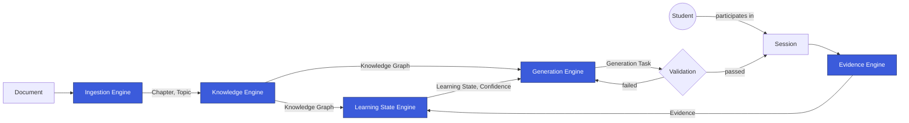
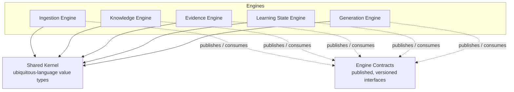

# Architecture

> Audience: AI coding agents and engineers implementing or extending any Engine.
> This document is the canonical, detailed architecture reference. `docs/architecture-overview.md`
> is the same architecture explained for a human, less-technical audience — if the two ever
> disagree, this document wins and the other is stale and must be fixed.

## 1. Architectural Style

Smart App is built as a **modular monolith**: one deployable service (`argus-mind-service`)
containing five independently-modeled Engines, each with an enforced boundary, communicating only
through explicit, versioned contracts. This is a deliberate choice, not a default — see ADR-001.
It gives us most of the coupling discipline of microservices without the operational cost of
distributed systems before the domain model has proven itself.

An Engine may be extracted into its own deployable service later **without changing its
contract**, because the contract, not the process boundary, is the real architectural unit.

## 2. The Five Engines

| Engine | Responsibility | Owns (private) | Publishes (contract) |
|---|---|---|---|
| **Ingestion Engine** | Turn a raw Document into structured, analyzable material | Chunk, chunking/parsing strategy | Document, Chapter, Topic |
| **Knowledge Engine** | Build and maintain the Knowledge Graph from ingested material | extraction/graph-building strategy | Knowledge Graph, Learning Node, Knowledge Edge |
| **Evidence Engine** | Capture what happened during a Student's Session as immutable fact | Session transport/collection details | Evidence, Session |
| **Learning State Engine** | Derive each Student's Learning State from Evidence | confidence model/algorithm | Learning State, Confidence |
| **Generation Engine** | Decide and produce the next right piece of content for a Student, gated by Validation | generation technique/model choice | Generation Task, Validation outcome |

Full term definitions live in `/glossary/README.md`. This table states *ownership*: only the
owning Engine may define, store, or evolve the internal representation of a term in its "Owns"
column. Everything in the "Publishes" column is a contract other Engines may depend on.

## 3. Runtime Data Flow (the Adaptive Loop)

This diagram shows how data actually moves at runtime — the closed loop that makes the platform
"adaptive": ingested material becomes a Knowledge Graph, a Student's Session produces Evidence,
Evidence becomes Learning State, and Learning State plus the Knowledge Graph drives what the
Generation Engine produces next.

Key properties of this loop:

- It is a **loop**, not a pipeline: content delivered in a Session produces new Evidence, which
  updates Learning State, which shapes the next Generation Task.
- **Ingestion → Knowledge** is content-authoring time; **Evidence → Learning State → Generation**
  is Student-facing time. They run on independent cadences — ingesting a new Document does not
  block an in-progress Session.
- **Validation sits between Generation Engine and the Student.** A failed Validation loops back
  into Generation Engine; it never reaches `Session` directly. See Article V of the Constitution
  and ADR-005.

## 4. Module Relationships (allowed dependencies)

This diagram shows the *code-level* dependency graph — who is allowed to import what. It is
intentionally different from the runtime data-flow diagram above: at runtime Knowledge Engine's
output reaches Generation Engine, but at the module level neither Engine ever imports the other's
package. All cross-Engine access happens through published contract types that live outside both
Engines.

**Rules encoded in this diagram:**

1. An Engine may depend on `Shared Kernel` (pure ubiquitous-language types: `Student`,
   `LearningNodeId`, timestamps, identifiers — data, no behavior) and on `Engine Contracts`
   (published interfaces/events other Engines expose).
2. An Engine must never depend on another Engine's package directly. This is enforced in code
   review (`review-checklist.md`) and should be enforced by lint/import-boundary tooling as soon
   as `src/` exists.
3. `Shared Kernel` must never depend on any Engine. It is the bottom of the dependency graph.
4. A contract change is a cross-cutting change and requires an ADR if it breaks an existing
   consumer (Article VII of the Constitution).

## 5. Engine Internal Shape

Every Engine, once implemented, follows the same internal shape so that any agent working in one
Engine already understands the layout of every other Engine:

- **domain/** — the Engine's own model and business rules. No framework, no I/O.
- **application/** — use cases / orchestration of the domain, expressed in ubiquitous language.
- **ports/** — interfaces the Engine needs (outbound) or offers (inbound), including its published
  contract.
- **adapters/** — concrete implementations of ports (storage, messaging, external calls).

This is a hexagonal / ports-and-adapters shape applied uniformly. See `coding-philosophy.md` for
the rules that govern what may live in each layer. This shape is *specified* here; it is
*materialized* on disk starting in the implementation phase, not in this foundation phase — see
`docs/repository-structure.md` for the distinction between what exists today and what is planned.

## 6. Non-Functional Boundaries

- **No Engine calls another Engine synchronously in a way that makes it a single point of
  failure for the whole loop.** Evidence capture must never fail because Generation Engine is
  down; Ingestion must never block because Learning State Engine is unavailable.
- **Every cross-Engine contract is versioned.** Consumers pin the version they were built against;
  producers may add fields but must not silently change the meaning of an existing field.
- **Chunk never crosses a boundary.** See Article VI of the Constitution and ADR-002.
- **Confidence is never written directly across any boundary.** See Article IV of the Constitution
  and ADR-004.

## 7. Related Documents

- `constitution.md` — the non-negotiable rules this architecture implements.
- `coding-philosophy.md` — how code inside an Engine should be written.
- `/glossary/README.md` — definitions of every term used in this document.
- `/adr/` — the record of why the architecture looks like this, especially ADR-001 through ADR-005.
- `/docs/architecture-overview.md` — this document, explained for a non-implementer audience.
