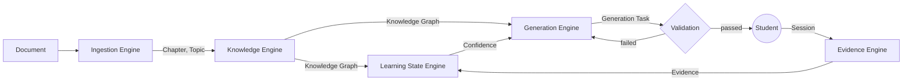

# Project Overview

## What Smart App Is

`argus-mind-service` is the adaptive-learning backend for **Smart App**. Smart App is not an AI
tutor and not an educational app — it's an attempt to prove one hypothesis:

> A student who builds a mental model of a subject **before** classroom exposure learns more
> efficiently than one who first encounters it during class.

The product is the **methodology** that makes this true — how a Knowledge Graph is built, how a
Student's understanding is estimated from Evidence, and how content adapts to that estimate. The AI
model behind Generation Engine is a replaceable implementation detail, not the product. Every
engineering decision should preserve that distinction.

## The Five Engines

| Engine | Job |
|---|---|
| **Ingestion** | Turn a raw Document into structured Chapters/Topics. Owns `Chunk` privately (never exposed). |
| **Knowledge** | Build the Knowledge Graph — Learning Nodes connected by prerequisite Knowledge Edges. |
| **Evidence** | Capture what a Student did during a Session, as immutable fact. |
| **Learning State** | Derive Confidence per Learning Node from Evidence — always estimated, never edited directly. |
| **Generation** | Decide and produce the next content for a Student; nothing reaches them without passing Validation. |

Each Engine owns its own model and exposes only a narrow contract to the others — see `CLAUDE.md`
for the exact boundary rules. This is a modular monolith (one deployable, five internally-separated
domains), not microservices — see `adr/ADR-001-five-engine-architecture.md`.

## Non-Negotiable Product Principles

1. **Learning before classroom** — the platform's job happens before the Student sits in class.
2. **Evidence over assumptions** — nothing about a Student's understanding is assumed, only observed.
3. **Adaptation over repetition** — a failed explanation gets a different approach, not a repeat.
4. **Understanding over memorization** — retrieval/spacing serve durable understanding, not rote recall.
5. **Small improvements over perfect lessons** — only the problematic Learning Node gets regenerated.
6. **The system estimates learning, it never judges the Student** — a low Confidence is information
   about what to do next, never a verdict on the Student.

See `memory/domain-rules.md` for the operational rules these principles imply, and
`memory/pedagogy.md` for the learning-science basis behind them.

## Status

The repository has a spec for every Engine (`specs/`), five foundational architecture decisions
(`adr/`), and one approved implementation plan (`tasks/sprint-001.md`) — but no application code yet.
`src/` does not exist. See `tasks/backlog.md` for what's planned and in what order.

## Where Things Live

- `CLAUDE.md` — binding rules for anyone (human or agent) working in this repo.
- `specs/` — one spec per feature, in Business Context → Goals → API → Definition of Done shape.
- `adr/` — why an irreversible or cross-Engine decision was made.
- `tasks/` — the backlog, the current sprint plan, and what's actively being worked.
- `memory/` — coding standards, API conventions, the glossary, domain rules, and the pedagogy behind them.
- `prompts/` — the handful of prompts actually used day to day.
- `.claude/agents/` — the subagent roster (architect, backend, reviewer, tester, docs).
