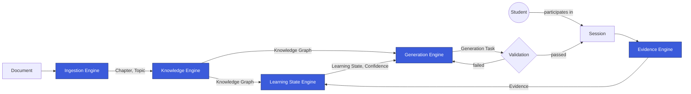

# argus-mind-service

`argus-mind-service` is the adaptive-learning core of **Smart App**. It is not a feature of the
product — it is the "mind" the rest of the product is built around: the part that models what a
Student knows, honestly, and decides what they should encounter next.

Smart App is not an AI education app. The AI used inside it is a replaceable implementation detail.
The durable product is the **methodology** — five Engines and the contracts between them, forming a
closed loop from raw source material to Validated, personalized content:

Read the full story in [`docs/vision.md`](docs/vision.md) and
[`docs/architecture-overview.md`](docs/architecture-overview.md).

## Repository Status

This repository is currently in **Phase 1 — Foundation**: the engineering governance,
specification, and architecture layer only. There is deliberately no application code, no API, and
no business logic yet — see [`docs/repository-structure.md`](docs/repository-structure.md) for
exactly what exists today versus what is planned for the implementation phase, and why that order
matters for a codebase built largely by AI coding agents across many sessions.

## Start Here

| If you want to… | Go to |
|---|---|
| Understand why this exists | [`docs/vision.md`](docs/vision.md) |
| Understand how it's structured | [`docs/architecture-overview.md`](docs/architecture-overview.md) |
| Learn the precise meaning of a term | [`glossary/README.md`](glossary/README.md) |
| Understand *why* a decision was made | [`adr/README.md`](adr/README.md) |
| Make a change | [`docs/development-workflow.md`](docs/development-workflow.md) |
| Know the rules that bind every change | [`.ai/constitution.md`](.ai/constitution.md) |

## The Governance Layer

- [`.ai/`](.ai) — the binding rules for humans and AI agents alike: constitution, detailed
  architecture, coding philosophy, development process, review checklist, definition of done.
- [`docs/`](docs) — the same substance, told for a human getting oriented.
- [`glossary/`](glossary) — the ubiquitous language: one precise definition per business term, used
  identically everywhere.
- [`adr/`](adr) — the record of why the architecture's irreversible decisions were made.

If any of the above ever disagree with each other, `.ai/` is canonical — each `docs/` page says so
explicitly at the top.

## Project

- **Language / tooling:** Python (`>=3.14`), managed with Poetry — see `pyproject.toml`. No
  dependencies are declared yet; none will be added until a spec requires them.
- **License / stack details:** not yet decided — tracked as future ADRs when they become concrete
  decisions rather than speculative ones.
