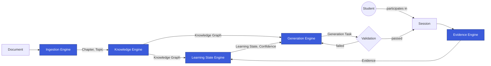

# argus-mind-service

`argus-mind-service` is the adaptive-learning core of **Smart App**. It is not a feature of the
product — it is the "mind" the rest of the product is built around: the part that models what a
Student knows, honestly, and decides what they should encounter next.

Smart App is not an AI education app. The AI used inside it is a replaceable implementation detail.
The durable product is the **methodology** — five Engines and the contracts between them, forming a
closed loop from raw source material to Validated, personalized content:



| Engine | Responsibility |
|---|---|
| **Ingestion Engine** | Turns a raw Document into structured Chapters and Topics. |
| **Knowledge Engine** | Turns structured material into a Knowledge Graph of Learning Nodes. |
| **Evidence Engine** | Captures what a Student actually did during a Session, as fact. |
| **Learning State Engine** | Derives what a Student currently knows, from their Evidence. |
| **Generation Engine** | Decides and produces the next right piece of content, gated by Validation. |

Read the full story in [`docs/vision.md`](docs/vision.md) and
[`docs/architecture-overview.md`](docs/architecture-overview.md).

## Table of Contents

- [Repository Status](#repository-status)
- [Repository Layout](#repository-layout)
- [Getting Started](#getting-started)
- [Documentation](#documentation)
- [The Governance Layer](#the-governance-layer)
- [Contributing](#contributing)
- [License](#license)

## Repository Status

This repository is currently in **Phase 1 — Foundation**: the engineering governance,
specification, and architecture layer only. There is deliberately no application code, no API, and
no business logic yet — see [`docs/repository-structure.md`](docs/repository-structure.md) for
exactly what exists today versus what is planned for the implementation phase, and why that order
matters for a codebase built largely by AI coding agents across many sessions.

## Repository Layout

```
argus-mind-service/
├── .ai/         Binding rules for humans and AI agents: constitution, architecture,
│                 coding philosophy, development process, review checklist, definition of done.
├── docs/        Human-facing documentation: vision, architecture overview, workflow, structure.
├── glossary/    The ubiquitous language — one precise definition per business term.
├── adr/         Architecture Decision Records — why irreversible decisions were made.
├── src/         (planned) Application code, once the implementation phase begins.
├── tests/       (planned) Unit, integration, and contract tests.
├── pyproject.toml
└── README.md    This file.
```

See [`docs/repository-structure.md`](docs/repository-structure.md) for the full tree, an
explanation of every folder, and the planned internal shape of each Engine.

## Getting Started

- **Prerequisites:** Python `>=3.14`, [Poetry](https://python-poetry.org/) for dependency
  management.
- **Setup:**

  ```bash
  poetry install
  ```

There is nothing to run yet — no dependencies are declared and no application code exists (see
[Repository Status](#repository-status)). This section will grow real run/test commands once the
implementation phase begins.

## Documentation

| If you want to… | Go to |
|---|---|
| Understand why this exists | [`docs/vision.md`](docs/vision.md) |
| Understand how it's structured | [`docs/architecture-overview.md`](docs/architecture-overview.md) |
| Learn the precise meaning of a term | [`glossary/README.md`](glossary/README.md) |
| Understand *why* a decision was made | [`adr/README.md`](adr/README.md) |
| Make a change | [`docs/development-workflow.md`](docs/development-workflow.md) |
| Know the rules that bind every change | [`.ai/constitution.md`](.ai/constitution.md) |

## The Governance Layer

- [`.ai/`](.ai) — the binding rules for humans and AI agents alike: constitution, detailed
  architecture, coding philosophy, development process, review checklist, definition of done.
- [`docs/`](docs) — the same substance, told for a human getting oriented.
- [`glossary/`](glossary) — the ubiquitous language: one precise definition per business term, used
  identically everywhere.
- [`adr/`](adr) — the record of why the architecture's irreversible decisions were made.

If any of the above ever disagree with each other, `.ai/` is canonical — each `docs/` page says so
explicitly at the top.

## Contributing

Every change follows the same lifecycle: **Spec → (ADR, if irreversible or cross-Engine) → Plan →
Implement → Definition of Done → Review → Merge.** Read
[`docs/development-workflow.md`](docs/development-workflow.md) before opening a change, and check
your work against [`.ai/definition-of-done.md`](.ai/definition-of-done.md) before requesting
review. Reviewers use [`.ai/review-checklist.md`](.ai/review-checklist.md).

The non-negotiable rules behind all of this — Engine boundaries, the ubiquitous language, the
Evidence/Validation guarantees — are in [`.ai/constitution.md`](.ai/constitution.md).

## Project

- **Language / tooling:** Python (`>=3.14`), managed with Poetry — see `pyproject.toml`. No
  dependencies are declared yet; none will be added until a spec requires them.

## License

Not yet decided — tracked as a future ADR once it becomes a concrete decision rather than a
speculative one.
