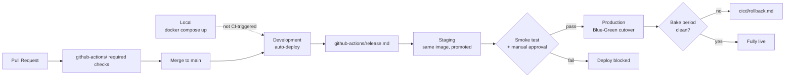

# CI/CD Strategy

The environment topology and release mechanics that `automation/github-actions/deploy.md` and
`automation/github-actions/release.md` execute. Those two are the *workflow* specs (trigger, steps,
gate); this folder is the *strategy* they implement.

## Pipeline Overview

## Index

| Document | Covers |
|---|---|
| [`environments.md`](environments.md) | Local, Development, Staging, Production — purpose, trigger, and the promote-never-rebuild rule. |
| [`blue-green.md`](blue-green.md) | How a Production deploy actually cuts over traffic. |
| [`rollback.md`](rollback.md) | Fast traffic rollback vs. version rollback, and what rollback deliberately does not undo (Evidence/Learning State). |
| [`versioning-and-tagging.md`](versioning-and-tagging.md) | Semantic versioning scheme, git/image tag format, and contract-level versioning. |

## The Non-Negotiable Thread Through All Four

Every document here ultimately protects the same guarantee: **Production never receives an artifact
that wasn't the exact, already-validated artifact from Staging**, and **a rollback never touches
recorded Evidence or Learning State** (ADR-003, ADR-004) — a code-version problem and a data-quality
problem are always handled through two different, explicit mechanisms, never conflated.
