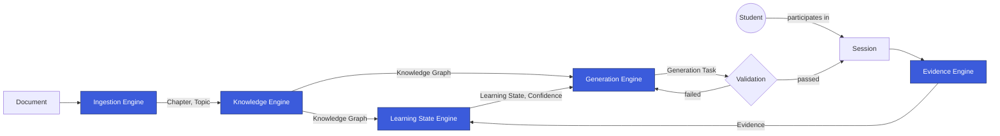

# Architecture Overview

> This is the human-readable tour of the architecture. For the detailed, implementation-binding
> version — contract tables, module dependency rules, internal Engine shape — see
> `/.ai/architecture.md`, which is the canonical source if this document and that one ever
> disagree.

## The Shape of the System

Smart App is built as **one deployable service containing five distinct Engines**, each
responsible for one part of the adaptive learning loop. Think of each Engine as its own small
department with a clear job and a clear way of talking to the others — not a shared pile of code
everyone edits freely.

| Engine | In one sentence |
|---|---|
| Ingestion Engine | Turns a raw Document into structured Chapters and Topics. |
| Knowledge Engine | Turns structured material into a Knowledge Graph of Learning Nodes. |
| Evidence Engine | Captures what a Student actually did during a Session, as fact. |
| Learning State Engine | Works out what a Student currently knows, from their Evidence. |
| Generation Engine | Decides and produces the next right piece of content, and gets it Validated. |

## Following the Loop

Read this diagram as two halves that meet in the middle:

- **The left half (Ingestion → Knowledge) happens on content time.** Someone adds a Document; the
  platform structures it and folds it into the Knowledge Graph. This does not involve any
  particular Student and does not happen "live" during a Session.
- **The right half (Session → Evidence → Learning State → Generation → Validation) happens on
  Student time.** It runs continuously for every active Student, using whatever the Knowledge Graph
  currently looks like.
- **They meet at Generation Engine**, which needs both: the map of what *can* be known (Knowledge
  Graph) and the read on what *this Student* currently knows (Learning State), to decide what to
  produce next.

## Why a Loop, Not a Pipeline

A pipeline runs once and produces a result. This is a loop on purpose: everything a Student does
in a Session becomes Evidence, which changes Learning State, which changes what Generation Engine
produces next time. The system's model of a Student is never final — it's continuously
re-derived from the most recent Evidence. That's what makes the platform "adaptive" in a literal,
checkable sense rather than as a marketing word.

## Why Validation Sits Where It Does

Validation is drawn as a gate between Generation Engine and the Student, not as a step "inside"
Generation Engine, because it is a genuinely separate concern with a different job: Generation
Engine's job is to produce something relevant; Validation's job is to refuse to let through
anything that's wrong, unsafe, or pedagogically unsound, regardless of how it was produced. Keeping
it a separate, explicit gate means it can evolve — add new checks, tighten existing ones — without
anyone touching how content gets generated. See ADR-005.

## Boundaries, in Plain Terms

Each Engine keeps its own working details to itself. The clearest example: **Chunk** — the small
pieces of text Ingestion Engine breaks a Document into for its own internal processing — is never
seen by any other Engine. If Ingestion changes how it chunks text tomorrow, nothing downstream
needs to know or care, because Chunk was never part of what Ingestion promised anyone else. That
promise — what an Engine exposes versus what it keeps private — is the real architectural
boundary, more than any folder or service line. See `/.ai/architecture.md` §2 for the full table of
what each Engine owns privately versus publishes, and ADR-002 for why Chunk specifically stays
internal.

## Where to Go Next

- Precise contracts, module dependency rules, and internal Engine layout: `/.ai/architecture.md`.
- Why the system is one service instead of five, and the other foundational decisions:
  `/adr/README.md`.
- The exact meaning of every term used above: `/glossary/README.md`.
- How a change actually gets made, end to end: `development-workflow.md`.
- The planned folder layout that will host this architecture in code: `repository-structure.md`.
