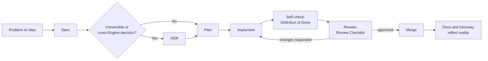

# Development Workflow

> This is the human-readable walkthrough of how a change gets made. The binding, detailed version
> of these rules lives in `/.ai/development-principles.md`; the gates referenced below live in
> `/.ai/definition-of-done.md` and `/.ai/review-checklist.md`. If this document and those disagree,
> the `.ai/` versions win.

## The Path a Change Takes

## Walking Through It

**1. Start from a Spec, not from code.** Every change begins by writing down, in ubiquitous
language, what should be true once it's done. If describing the change requires a term that isn't
in `/glossary/README.md` yet, that's the first thing to fix — add the term before writing the rest
of the spec.

**2. Decide if this needs an ADR.** Ask: would reversing this decision later require breaking a
published contract, migrating data with no safe rollback, or renaming a glossary term? If yes,
write the ADR now, using `/adr/template.md`, before planning implementation. Most day-to-day
changes don't need one — only decisions with real, hard-to-reverse weight do.

**3. Plan before implementing.** Identify which Engine(s) the change touches. If a plan seems to
require touching more than one Engine's internals, stop — that's usually a sign the work should be
expressed as a contract change plus independent work in each Engine, not as one change that
straddles a boundary.

**4. Implement to the Spec.** Follow `/.ai/coding-philosophy.md`. Resist doing more than the Spec
asked for, even when a "nice to have" is sitting right there — that's Article VIII of the
Constitution, and it applies to AI agents as much as to humans.

**5. Self-check against Definition of Done.** Before asking anyone to review the work, walk through
`/.ai/definition-of-done.md` honestly. Most rework this catches is cheaper to catch here than in
review.

**6. Review against the Review Checklist.** A reviewer works through
`/.ai/review-checklist.md` independently — boundaries, ubiquitous language, data integrity, the
Validation gate, code quality, tests, and documentation. Sections on boundaries and data integrity
are non-negotiable; they don't get approved "with a follow-up."

**7. Merge, then confirm the map still matches the territory.** If the change altered behavior a
document describes, that document was already updated as part of the change (not after) — Step 6
checks this, Step 7 is just the final state: docs and code should never visibly disagree.

## What This Looks Like for Different Sizes of Change

- **A change entirely inside one Engine's private implementation** (an internal algorithm, a
  private helper): Spec → Plan → Implement → Definition of Done → Review → Merge. No ADR needed.
- **A change to a published contract, additive only** (a new optional field, a new operation that
  doesn't break existing consumers): same as above, no ADR needed, but the contract test suite for
  every consumer must still pass.
- **A change to a published contract that breaks an existing consumer, or a new business concept,
  or a new Engine:** the full path, ADR included, per `/.ai/development-principles.md` §2 and §8.

## Why the Gates Are Split in Two

Definition of Done and the Review Checklist look similar but serve different people at different
moments: Definition of Done is what the *author* checks about their *own* work before asking for
eyes on it. The Review Checklist is what an independent *reviewer* verifies, without assuming the
author's self-check was thorough. Splitting them catches more real problems than either alone.
