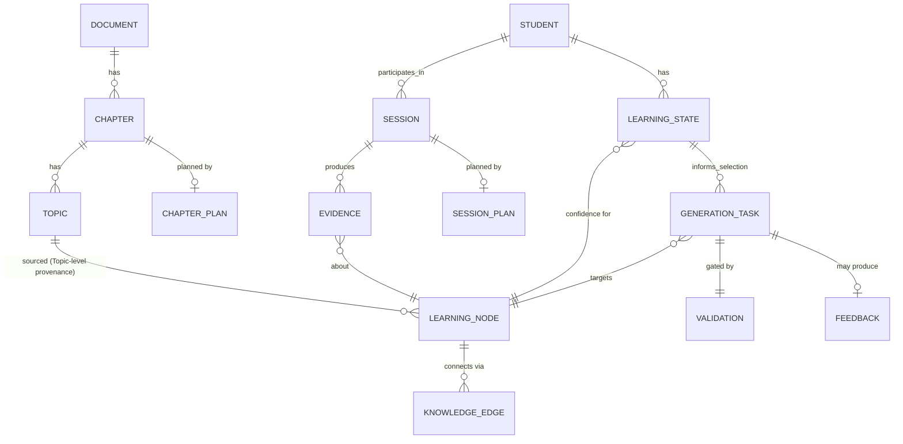

# Domain Model

The complete ubiquitous language, in depth: every entity's attributes, relationships, and lifecycle
notes. `glossary/README.md` remains the **canonical, concise** definition of each term
(`.ai/constitution.md` Article VI) — this folder is its companion, adding the detail a one-paragraph
glossary entry deliberately omits. Where the two ever appear to disagree, `glossary/README.md` wins;
in practice they're maintained together and should never actually diverge.

## Index

| File | Entities |
|---|---|
| [`ingestion-entities.md`](ingestion-entities.md) | Document, Chapter, Topic, Chunk *(internal)*, OCRResult *(internal)*, Embedding *(internal)* |
| [`knowledge-entities.md`](knowledge-entities.md) | Learning Node, Knowledge Edge, Knowledge Graph, Learning Path |
| [`evidence-entities.md`](evidence-entities.md) | Session (Study Session), Evidence, EvidenceType |
| [`learning-state-entities.md`](learning-state-entities.md) | Learning State, Confidence |
| [`generation-entities.md`](generation-entities.md) | GenerationTask, Validation, Difficulty, PromptContext, Feedback, Reinforcement, AdaptiveContent, MindMap, Summary, Game, Quiz, SessionPlan, ChapterPlan |
| [`cross-cutting-entities.md`](cross-cutting-entities.md) | Student |

## Entity Relationships

Note what this diagram deliberately omits: Chunk, OCRResult, and Embedding — all internal-only to
Ingestion Engine (ADR-002 and its extensions in `ingestion-entities.md`) and therefore not part of
any cross-Engine relationship a consumer should ever reason about.

## Naming Conventions Used Throughout This Folder

- **Prose form** ("Learning Node," "Learning Path") matches `glossary/README.md`'s spelling exactly.
- **Code form** (`LearningNode`, `LearningPath`) is PascalCase per `skills/python.md` — the same
  entity, not a different one.
- **"Study Session"** is the product/pedagogy name for the same entity `glossary/README.md` and
  `specs/evidence-engine.md` call **Session** — see `evidence-entities.md`'s note.
- **AdaptiveContent** is a Student-facing umbrella term over MindMap/Summary/Game/Quiz/Reinforcement,
  never a type used directly in engineering code once a concrete content type is known — see
  `generation-entities.md`.

## Related Documents

`glossary/README.md`, `.ai/constitution.md` Article VI, `docs/domain-rules/README.md`.
