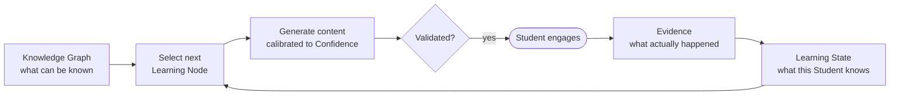

# Adaptive Learning

## What "Adaptive" Means Here

"Adaptive" is used precisely in this platform, not as marketing language. An adaptive system changes
its behavior as a direct, traceable function of observed Evidence about a specific Student — not on
a schedule, not by Student self-report alone, and not by a generic difficulty slider. If a system
can't point to the Evidence that caused a specific adaptation, it isn't adaptive by this platform's
definition — it's just personalized-looking.

## The Loop, Pedagogically

`.ai/architecture.md` §3 describes the Adaptive Loop as an engineering data-flow diagram. This
document describes the same loop in terms of what's actually happening cognitively at each stage:

- **Selection** is where Desirable Difficulties (`docs/pedagogy/desirable-difficulties.md`) is
  applied: the target Learning Node and difficulty are chosen to sit just past the edge of the
  Student's current Confidence, not comfortably within it and not far beyond it.
- **Generation** is where encoding principles apply — Dual Coding, Elaboration, Chunking, the
  Generation Effect — shaping *how* the content asks the Student to engage, not just what topic it
  covers.
- **Evidence** is where the loop stays honest: whatever the Student actually does is what updates
  the model, not what the system predicted they would do.

## Why Not Simpler Alternatives

**A fixed curriculum sequence** doesn't adapt at all — every Student receives the same order
regardless of what they demonstrably know, which contradicts Evidence Over Assumptions
(`docs/domain-principles.md` §4).

**A difficulty slider set by the Student** adapts to stated preference, not demonstrated
understanding — Students are notoriously poor judges of their own mastery (see
`docs/pedagogy/metacognition.md`'s treatment of the Dunning-Kruger-adjacent literature on
self-assessment accuracy), so this would optimize for comfort over learning.

**A single AI tutor answering ad hoc questions** adapts to whatever the Student happens to ask, which
is reactive to curiosity, not to what the Knowledge Graph says is actually load-bearing for their
next class. This is a legitimate and different product; it is not Smart App's thesis
(`docs/domain/product-philosophy.md`).

## Adaptation Operates at Two Timescales

- **Within a Session**: the immediate next piece of content responds to the Student's last response
  (`specs/study-session.md`) — fast adaptation, small scope (usually one Learning Node).
- **Across Sessions**: Confidence decay and accumulated Evidence reshape which Learning Nodes are
  prioritized over days and weeks (`docs/domain/learning-state-engine.md`), consistent with Spaced
  Repetition (`docs/pedagogy/spaced-repetition.md`) — slow adaptation, broad scope (the whole
  Knowledge Graph the Student has touched).

Both timescales are the *same* mechanism (Evidence → Learning State → selection) operating at
different frequencies — there is deliberately no separate "long-term adaptation" subsystem, per
`.ai/coding-philosophy.md` §6's stance against unnecessary abstraction.

## What Adaptive Learning Is Not, In This Product

Not: adaptive *pacing only* (just speeding up or slowing down the same fixed content). Not:
adaptive *difficulty only* (just easier/harder versions of the same explanation). The platform
adapts **what** is generated, **how** it's presented, and **when** it's revisited, jointly, because
the pedagogy principles that inform each of those three dimensions are often most effective in
combination (e.g., Retrieval Practice at Spaced intervals, per `docs/pedagogy/spaced-repetition.md`'s
evidence section).

## Related Documents

`.ai/architecture.md` §3, `docs/domain-principles.md` §5, `docs/pedagogy/desirable-difficulties.md`,
`docs/domain/learning-state-engine.md`, `docs/domain/generation-engine.md`.
