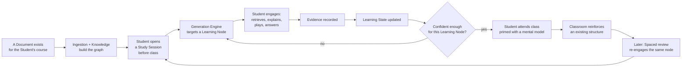

# The Student Journey

This document narrates the Core Product Thesis (`docs/domain-principles.md`) as one Student's actual
experience, end to end, so every Engine's contribution is visible in context rather than only as an
isolated technical responsibility.

## Journey Map

## Walking Through It

**Before any Student is involved:** a teacher or the platform ingests course material
(`specs/document-ingestion.md`). Knowledge Engine turns it into a graph of Learning Nodes
(`docs/domain/knowledge-engine.md`) — this happens once per Document, shared across every Student
who will study from it.

**The Student opens a Study Session, before class.** This timing is the entire premise of the
product (`docs/domain-principles.md` §1) — the platform is not competing for the Student's first
exposure to material during class; it's claiming the moments before it.

**Generation Engine picks one Learning Node** — not the next item in a fixed syllabus order, but the
one the Knowledge Graph and this Student's Learning State say is both reachable (prerequisites
sufficiently established) and not yet confidently known (`docs/domain/adaptive-learning.md`).

**The Student engages actively.** Whatever the content type — a Quiz question, a MindMap to
complete, a Feynman-style self-explanation prompt, a Game — the Student is doing something, not just
reading (`docs/domain-principles.md` §2, the Generation Effect).

**Evidence is recorded, unconditionally**, regardless of whether the Student got it "right" — the
observation itself is what matters (`docs/domain/evidence-engine.md`).

**Learning State updates**, and the loop either continues (this Learning Node isn't confident enough
yet — try a different angle, informed by Feedback on what specifically didn't land) or moves to the
next Learning Node.

**The Student walks into class already holding a mental model.** This is the moment the Core Product
Thesis is either validated or it isn't — everything upstream exists to produce this moment.
Classroom instruction now has something to attach to, reinforcing structure rather than installing
it from nothing (`docs/domain-principles.md` §3).

**Later, spaced in time, the same Learning Node resurfaces** — not because the Student asked for
review, but because Learning State's decay model determined it was due
(`docs/pedagogy/spaced-repetition.md`), closing the loop back to another Study Session.

## Why This Journey, Not a Simpler One

A simpler journey — Student asks a question, AI answers it — has no Knowledge Graph, no Learning
State, no notion of "before class," and no mechanism for spaced revisiting. It would be a
perfectly reasonable different product. It is not this one; see
`docs/domain/product-philosophy.md`'s "What This Rules Out."

## Related Documents

`docs/domain-principles.md`, `docs/domain/adaptive-learning.md`, `specs/study-session.md`,
`docs/evaluation/README.md` (how this journey's success is actually measured).
