# Repository Structure

This document has two parts, and the distinction between them matters: **what exists today**
(Phase 1 — Foundation: governance and specification only, no application code) and **what is
planned** for the implementation phase, so that the eventual `src/` layout is already specified
before anyone — human or AI agent — writes the first line of it. See
`/.ai/architecture.md` for the architectural reasoning behind the planned layout.

## Current State (Phase 1 — Foundation)

```
argus-mind-service/
├── .ai/                    Agent- and engineer-facing governance: the rules that bind every
│                            future change. Highest authority in the repository after none —
│                            this folder IS the authority. See .ai/constitution.md.
│   ├── constitution.md      The non-negotiable rules. Outranks every other document.
│   ├── architecture.md      Canonical, detailed system architecture and module contracts.
│   ├── coding-philosophy.md How code is written, once code exists.
│   ├── development-principles.md  The process a change follows, spec to merge.
│   ├── review-checklist.md  What a reviewer independently verifies.
│   └── definition-of-done.md  What an author checks before requesting review.
│
├── docs/                   Human-facing documentation: the same substance as .ai/, told for
│   │                        people orienting themselves, not for enforcement.
│   ├── README.md            Index of this folder.
│   ├── vision.md             Why Smart App exists and what it is not.
│   ├── architecture-overview.md  The architecture, explained.
│   ├── development-workflow.md   How a change gets made, explained.
│   ├── repository-structure.md   This document.
│   └── engineering-principles.md Distilled "how we build," pointing back into .ai/.
│
├── glossary/               The ubiquitous language. One canonical definition per business term,
│   └── README.md            used identically in specs, code, tests, and conversation.
│
├── adr/                    Architecture Decision Records: the durable "why" behind irreversible
│   │                        or cross-Engine decisions.
│   ├── README.md             Index and process for writing an ADR.
│   ├── template.md           The template every new ADR starts from.
│   ├── ADR-001-five-engine-modular-architecture.md
│   ├── ADR-002-chunk-is-an-internal-only-concept.md
│   ├── ADR-003-evidence-is-an-immutable-append-only-log.md
│   ├── ADR-004-confidence-is-a-derived-recomputable-projection.md
│   └── ADR-005-generation-output-must-pass-validation-gate.md
│
├── pyproject.toml          Python/Poetry project metadata. No dependencies declared yet —
│                            deliberately: no framework or library choice has been specced.
├── poetry.lock
└── README.md                Repository entry point; orients a new reader and links everywhere
                              above.
```

Nothing under `src/` or `tests/` exists yet, on purpose. Phase 1's job is the specification and
governance layer only — see the ROLE constraint that produced it: no application code, no APIs, no
business logic. The section below specifies where that code will go once a later phase begins
implementation, so that decision doesn't have to be re-derived then.

## Planned State (Implementation Phase)

```
argus-mind-service/
├── .ai/ docs/ glossary/ adr/ README.md   (as above, unchanged in shape, evolving in content)
│
├── src/
│   └── argus/
│       ├── ingestion_engine/       Owns: Document intake, Chapter/Topic structuring, Chunk
│       │                            (private). Publishes: Document, Chapter, Topic.
│       ├── knowledge_engine/       Owns: Knowledge Graph construction/maintenance. Publishes:
│       │                            Knowledge Graph, Learning Node, Knowledge Edge.
│       ├── evidence_engine/        Owns: Session capture. Publishes: Evidence, Session.
│       ├── learning_state_engine/  Owns: the confidence model. Publishes: Learning State,
│       │                            Confidence.
│       ├── generation_engine/      Owns: generation technique, Validation execution. Publishes:
│       │                            Generation Task, Validation outcome.
│       ├── shared_kernel/          Pure ubiquitous-language value types shared read-only by every
│       │                            Engine (identifiers, Student, timestamps). No behavior, no
│       │                            dependency on any Engine.
│       └── platform/               Cross-cutting infrastructure wiring (configuration,
│                                    observability, process entrypoints). No business logic.
│
│       Each engine package above follows the same internal shape, specified in
│       /.ai/architecture.md §5:
│         <engine>/
│         ├── domain/         Business rules and models. No framework, no I/O.
│         ├── application/    Use cases orchestrating the domain.
│         ├── ports/           Interfaces the engine needs or offers, including its published
│         │                    contract.
│         └── adapters/        Concrete implementations of ports (storage, messaging, etc.).
│
├── tests/
│   ├── unit/               Tests of each Engine's functional core. No mocks needed — see
│   │                        /.ai/coding-philosophy.md §3.
│   ├── integration/        Tests of an Engine's adapters against its own ports.
│   └── contract/           Tests that pin the published contract between Engines; run against
│                            both producer and every consumer.
│
└── scripts/                 Operational and developer-experience scripts. Never business logic.
```

**Rule that governs the planned tree:** an Engine package may depend only on `shared_kernel` and on
published `Engine Contracts` (the `ports` any Engine exposes). It must never import another
Engine's package directly. See `/.ai/architecture.md` §4 for the enforced dependency graph and the
reasoning behind it.

## Diagram

```mermaid
flowchart TD
    ROOT[argus-mind-service]
    ROOT --> AI[.ai/]
    ROOT --> DOCS[docs/]
    ROOT --> GLOSS[glossary/]
    ROOT --> ADR[adr/]
    ROOT --> SRC["src/argus/ (planned)"]
    ROOT --> TESTS["tests/ (planned)"]
    ROOT --> README[README.md]

    AI --> AI1[constitution.md]
    AI --> AI2[architecture.md]
    AI --> AI3[coding-philosophy.md]
    AI --> AI4[development-principles.md]
    AI --> AI5[review-checklist.md]
    AI --> AI6[definition-of-done.md]

    SRC --> E1[ingestion_engine]
    SRC --> E2[knowledge_engine]
    SRC --> E3[evidence_engine]
    SRC --> E4[learning_state_engine]
    SRC --> E5[generation_engine]
    SRC --> SK[shared_kernel]
    SRC --> PLAT[platform]

    TESTS --> T1[unit]
    TESTS --> T2[integration]
    TESTS --> T3[contract]
```



## Why Governance Folders Come Before Code Folders

Everything under `src/` and `tests/` will eventually be generated or heavily assisted by AI coding
agents working across many sessions with no persistent memory of past conversations. `.ai/`,
`docs/`, `glossary/`, and `adr/` are what lets each of those sessions start from the same shared
understanding instead of re-deriving it — or silently drifting from it — every time. That is the
entire premise of this foundation phase.
