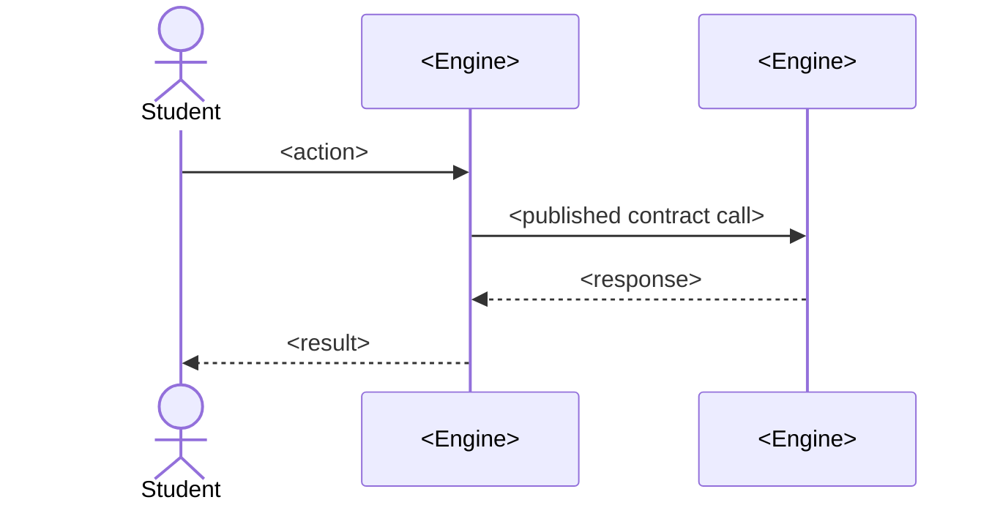
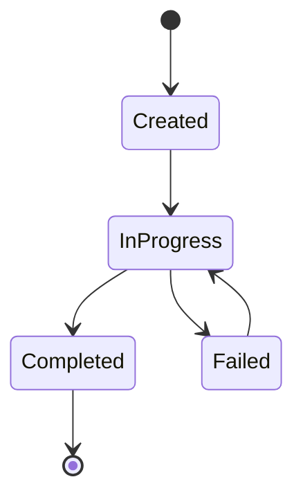

# Specification Template

> Copy this file to `specs/<kebab-case-feature-name>.md` and fill in every section. A section that
> genuinely doesn't apply is kept with a one-line "Not applicable: <why>" rather than deleted —
> that tells the next reader it was considered, not forgotten.
>
> Every specification is governed by `CLAUDE.md`. In particular: use only terms defined
> in `memory/glossary.md` (add a glossary entry in the same change if a concept is missing);
> if the spec requires an irreversible or cross-Engine decision, pair it with an ADR in `adr/`
> before implementation begins; implementation must satisfy `CLAUDE.md`'s Mandatory Workflow
> before it is considered complete.

---

# Spec: <Feature Name>

- **Status:** Draft | Approved | In Progress | Implemented | Superseded
- **Owning Engine(s):** <one or more of Ingestion, Knowledge, Evidence, Learning State, Generation,
  or "Cross-Engine" if this spec orchestrates several without owning any of their internals>
- **Related ADRs:** <link, or "None yet">
- **Author / Date:**

## Business Context

*Why does this need to exist, in terms a non-engineer stakeholder would recognize? What is true for
the Student (or the platform) today that this spec changes? Ground this in `PROJECT.md` and the
relevant Engine's responsibility in `CLAUDE.md (Architecture section)` §2 — a spec that can't explain its
business context in one paragraph usually isn't ready to be planned yet.*

## Goals

*The specific, checkable outcomes this spec is responsible for. Prefer "the platform can now X"
statements over implementation detail. Number them — Acceptance Criteria and Definition of Done
will refer back to these.*

1. …
2. …

**Non-goals:** *what this spec explicitly does not attempt, so scope doesn't silently creep during
implementation (Article VIII — no speculative generality).*

## Requirements

*Functional and non-functional requirements, in ubiquitous language. Tag each as **Functional** or
**Non-Functional** (performance, reliability, security, observability). Every requirement should be
traceable to a Goal above.*

| # | Requirement | Type | Traces to Goal |
|---|---|---|---|
| R1 | … | Functional | 1 |
| R2 | … | Non-Functional | 1 |

## Acceptance Criteria

*Concrete, testable statements — these become the shape of the tests written in the Red step of the
implementation workflow. Prefer Given/When/Then where it clarifies behavior.*

- [ ] **AC1** — Given …, when …, then …
- [ ] **AC2** — Given …, when …, then …

## Sequence Diagram

*How the relevant actors (Student, Engines, external systems) interact over time to deliver this
feature. Show Engine boundaries explicitly — a call that crosses from one Engine's lifeline to
another's must go through that Engine's published contract, never an internal detail.*

## State Diagram

*The lifecycle of the primary entity this spec introduces or changes, as explicit states and
transitions. If this spec doesn't introduce a stateful entity, replace this diagram with the
existing state diagram of the entity it affects, annotated with what's new.*

## API

*The contract surface this spec adds or changes — internal Engine contract, and/or externally
callable endpoint. State the shape, not the implementation. Follow the conventions in
`memory/api-conventions.md`. If the API is purely an internal Engine Contract (see
`CLAUDE.md (Architecture section)` §4) and not externally exposed, say so explicitly.*

| Method | Path / Contract | Request | Response | Notes |
|---|---|---|---|---|
| `POST` | `/v1/<resource>` | `{ … }` | `201 { … }` | … |

## Events

*Anything this spec publishes or consumes on the platform's event stream, if any. Event names use
glossary terms in past tense (`EvidenceRecorded`, not `RecordEvidence`) — an event describes
something that already happened, consistent with Evidence being immutable fact
(`CLAUDE.md`'s Evidence-is-truth rule).*

| Event | Producer | Consumers | Payload (key fields) |
|---|---|---|---|
| `<EventName>` | `<Engine>` | `<Engine(s)>` | `…` |

## Database

*Schema changes this spec requires, following the conventions in `memory/coding-standards.md`
(schema-per-Engine, no cross-Engine foreign keys — see `CLAUDE.md (Architecture section)` §4 for why). State
new tables/columns and their ownership; do not describe migration SQL here — that belongs to the
implementation, not the spec.*

| Table | Owning Engine | Key Columns | Notes |
|---|---|---|---|
| `<schema>.<table>` | `<Engine>` | … | … |

## Risks

*What could make this spec wrong, unsafe, or expensive to reverse. Be honest — an empty Risks
section is a sign the spec wasn't examined critically, not a sign it's risk-free.*

| Risk | Likelihood | Impact | Mitigation |
|---|---|---|---|
| … | Low / Medium / High | Low / Medium / High | … |

## Future Work

*Real, specific extensions that were deliberately scoped out (paired with the Non-goals above), so
a later spec can pick them up with context instead of rediscovering the idea from scratch. Not a
place for vague aspirations.*

- …

## Definition of Done

*Spec-specific completion criteria, in addition to — not instead of — `CLAUDE.md`,
which always applies. Reference this spec's own Goals and Acceptance Criteria explicitly.*

- [ ] All Acceptance Criteria above pass.
- [ ] `CLAUDE.md` is satisfied in full.
- [ ] Any new business concept used here has a `memory/glossary.md` entry.
- [ ] Any irreversible/cross-Engine decision made while implementing this spec has an ADR.
