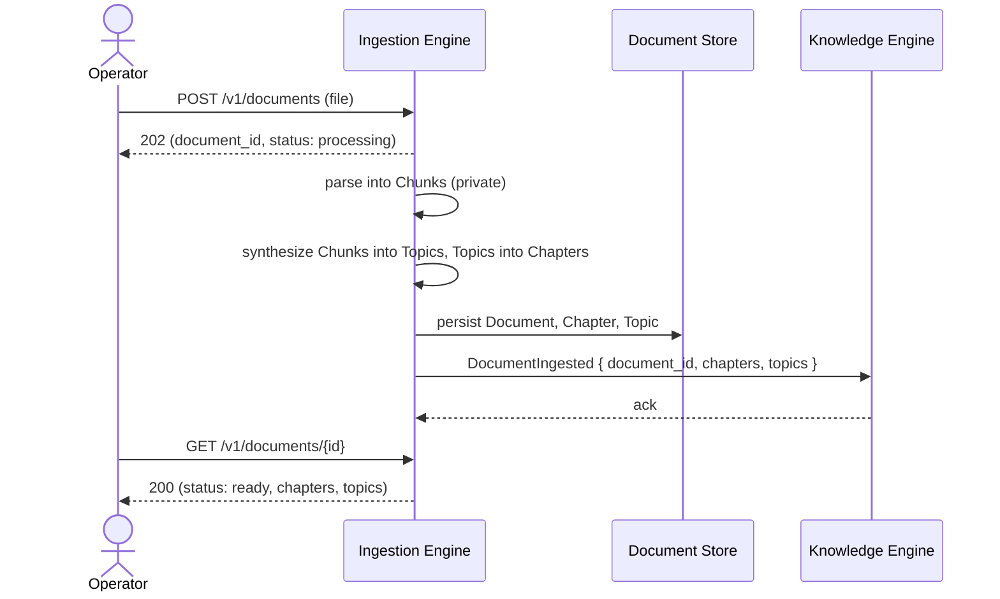
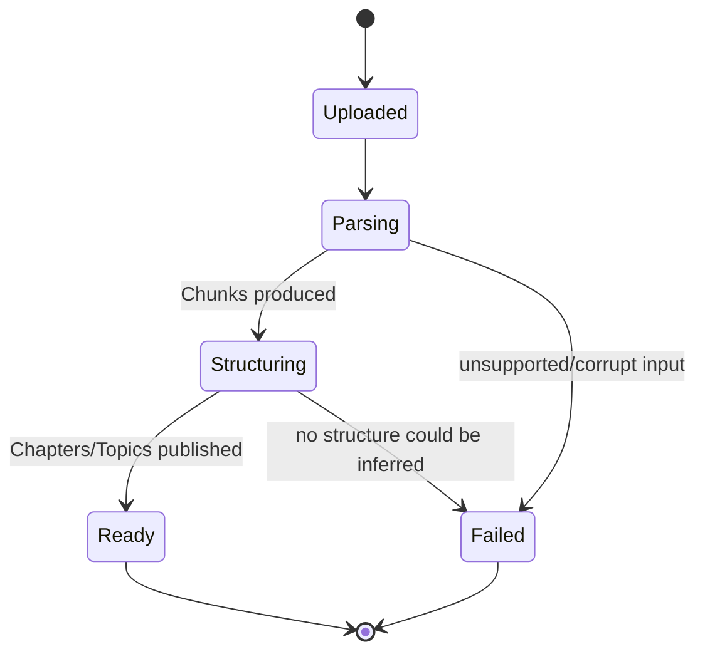

# Spec: Document Ingestion

- **Status:** Draft
- **Owning Engine(s):** Ingestion Engine
- **Related ADRs:** [ADR-002](../adr/ADR-002-chunk-internal-only.md) (Chunk stays
  internal to this Engine — binding on this spec's implementation).
- **Author / Date:** Phase 2 — Development

## Business Context

The Knowledge Graph can only ever be as good as the material it's built from. Before Knowledge
Engine can extract a single Learning Node, a raw Document needs to become structured, navigable
material: a Document broken into Chapters, each broken into Topics. This spec covers exactly that
first step of the Adaptive Loop (`CLAUDE.md` §3) — turning an uploaded Document into
Chapters and Topics ready for Knowledge Engine to consume. It does not cover extraction of Learning
Nodes themselves; that is `specs/knowledge-engine.md`.

## Goals

1. An operator can submit a raw Document (initially: PDF and plain text) to the platform.
2. The platform structures a submitted Document into an ordered set of Chapters, each containing an
   ordered set of Topics.
3. Ingestion Engine publishes Document, Chapter, and Topic data to Knowledge Engine without ever
   exposing its internal Chunk representation.
4. Ingestion failures are visible and specific, not silent.

**Non-goals:** authoring or editing Documents in-platform (ingestion only accepts already-authored
source material), ingesting non-text formats such as video or audio (Future Work), real-time
collaborative ingestion.

## Requirements

| # | Requirement | Type | Traces to Goal |
|---|---|---|---|
| R1 | Accept Document upload as PDF or UTF-8 plain text, up to a configured size limit. | Functional | 1 |
| R2 | Parse the Document into a Chapter/Topic structure, inferred from source formatting (headings) when available, or from a supplied outline otherwise. | Functional | 2 |
| R3 | Publish `Document`, `Chapter`, `Topic` records via Ingestion Engine's contract once structuring completes. | Functional | 3 |
| R4 | Never expose Chunk boundaries or content outside Ingestion Engine's own package. | Functional | 3 |
| R5 | Ingestion runs asynchronously; the caller is not blocked on parsing a large Document. | Non-Functional | 4 |
| R6 | A failed ingestion reports a specific, actionable reason (e.g., "unsupported format," "corrupt file," "no structure detected"). | Non-Functional | 4 |

## Acceptance Criteria

- [ ] **AC1** — Given a well-formed PDF with heading styles, when submitted, then the resulting
      Document has Chapters and Topics matching the heading hierarchy.
- [ ] **AC2** — Given a plain text file with no structural markers, when submitted with an explicit
      outline, then the resulting Document's Chapters/Topics match the supplied outline.
- [ ] **AC3** — Given a corrupt or empty file, when submitted, then ingestion fails with a specific
      reason and no partial Document is published.
- [ ] **AC4** — Given a successfully ingested Document, then no Chunk data is present anywhere in
      the published `Document`/`Chapter`/`Topic` contract or in Knowledge Engine's input.
- [ ] **AC5** — Given a Document larger than the configured size limit, when submitted, then the
      request is rejected synchronously before any processing begins.

## Sequence Diagram

## State Diagram

## API

| Method | Path | Request | Response | Notes |
|---|---|---|---|---|
| `POST` | `/v1/documents` | multipart file + optional outline | `202 { document_id, status }` | Async; returns immediately (R5). |
| `GET` | `/v1/documents/{document_id}` | — | `200 { status, chapters: [...], topics: [...] }` or `202` while processing | Never includes Chunk data (R4). |

## Events

| Event | Producer | Consumers | Payload (key fields) |
|---|---|---|---|
| `DocumentIngested` | Ingestion Engine | Knowledge Engine | `document_id`, `chapters[]`, `topics[]` |
| `DocumentIngestionFailed` | Ingestion Engine | Operator-facing notification (Platform) | `document_id`, `reason` |

## Database

| Table | Owning Engine | Key Columns | Notes |
|---|---|---|---|
| `ingestion.documents` | Ingestion Engine | `id`, `title`, `source_format`, `status`, `created_at` | Public-facing record. |
| `ingestion.chapters` | Ingestion Engine | `id`, `document_id`, `order`, `title` | Published downstream. |
| `ingestion.topics` | Ingestion Engine | `id`, `chapter_id`, `order`, `title`, `summary` | Published downstream. |
| `ingestion.chunks` | Ingestion Engine (private) | `id`, `topic_id`, `order`, `text`, `embedding` | **Never queried outside this Engine's own package** — see ADR-002. |

## Risks

| Risk | Likelihood | Impact | Mitigation |
|---|---|---|---|
| Heading-based structure inference misreads a poorly-formatted Document | Medium | Medium | Supplied-outline path (R2, AC2) as a fallback; AC3 fails loudly instead of publishing a wrong structure. |
| Large Documents cause long processing times | Medium | Low | Async processing (R5) with polling; size cap (AC5). |
| A future change accidentally exposes Chunk data in the publish step | Low | High | Contract type for `DocumentIngested` structurally cannot carry Chunk fields; enforced by review checklist §3. |

## Future Work

- Additional source formats (DOCX, HTML, video/audio transcripts).
- Re-ingestion / versioning of an already-ingested Document.
- Chunk-level provenance for traceability, as discussed (and explicitly deferred) in ADR-002.

## Definition of Done

- [ ] All Acceptance Criteria above pass, including AC4 verified by a contract test that fails if
      any Chunk field is ever added to the published contract.
- [ ] `CLAUDE.md` is satisfied in full.
- [ ] `DocumentIngested` contract test exists and runs against both Ingestion Engine (producer) and
      Knowledge Engine (consumer).
