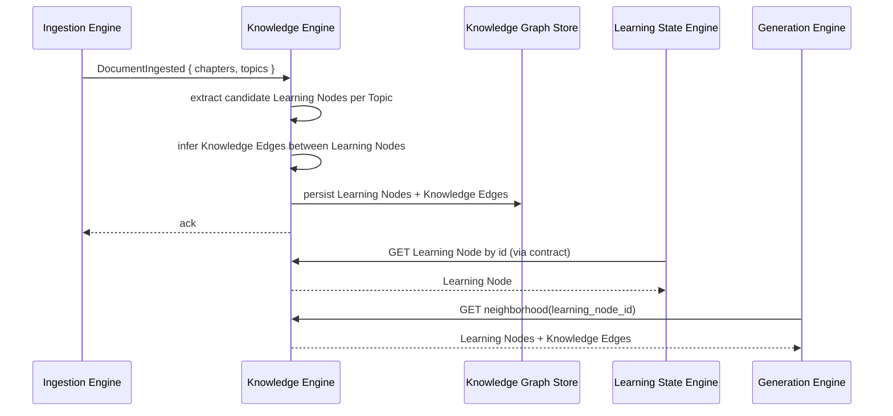
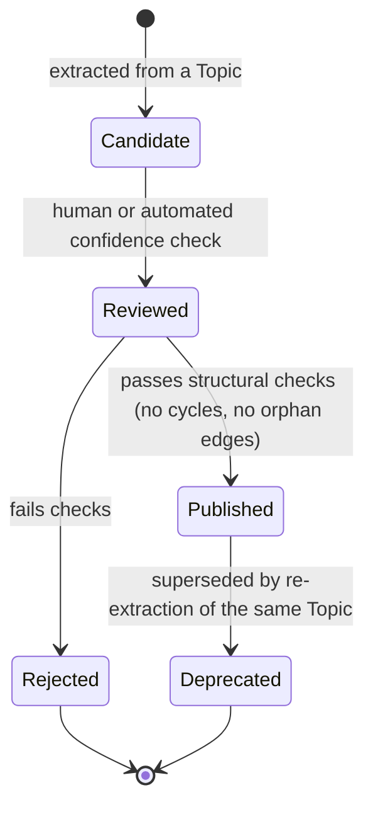

# Spec: Knowledge Engine — Knowledge Graph Construction

- **Status:** Draft
- **Owning Engine(s):** Knowledge Engine
- **Related ADRs:** [ADR-002](../adr/ADR-002-chunk-internal-only.md) (this Engine
  consumes Topic-level input only — never Chunk).
- **Author / Date:** Phase 2 — Development

## Business Context

Once Ingestion Engine has structured a Document into Chapters and Topics, the platform still has no
model of *what can be known* — only structured text. This spec is the step that turns Topics into
the Knowledge Graph: a set of Learning Nodes connected by Knowledge Edges. Everything downstream —
Learning State's per-node Confidence, Generation Engine's choice of what to produce next — depends
on this graph existing and being well-formed.

## Goals

1. When a Document finishes ingestion, Knowledge Engine extracts candidate Learning Nodes from its
   Topics.
2. Knowledge Engine infers Knowledge Edges between Learning Nodes (at minimum: prerequisite-of).
3. The resulting Knowledge Graph is queryable by Learning State Engine and Generation Engine
   through a published contract.
4. Extraction is reviewable — a human can see why a given Learning Node or Edge was proposed.

**Non-goals:** automatic merging of near-duplicate Learning Nodes across unrelated Documents
(Future Work), graph visualization tooling, real-time incremental re-extraction on partial Document
edits (Documents are immutable once ingested — see `specs/document-ingestion.md`).

## Requirements

| # | Requirement | Type | Traces to Goal |
|---|---|---|---|
| R1 | On `DocumentIngested`, extract one or more candidate Learning Nodes per Topic. | Functional | 1 |
| R2 | Infer at least prerequisite-of Knowledge Edges between extracted Learning Nodes, within and across Chapters of the same Document. | Functional | 2 |
| R3 | Publish the resulting Learning Nodes and Knowledge Edges as part of the queryable Knowledge Graph contract. | Functional | 3 |
| R4 | Record, per Learning Node, which Topic(s) it was extracted from (Topic-level provenance only — never Chunk-level, per ADR-002). | Functional | 4 |
| R5 | Knowledge Graph queries (by Learning Node, by neighborhood) return within acceptable latency for Generation Engine's synchronous use. | Non-Functional | 3 |
| R6 | Extraction is idempotent — re-processing the same `DocumentIngested` event does not duplicate Learning Nodes. | Non-Functional | 1 |

## Acceptance Criteria

- [ ] **AC1** — Given a `DocumentIngested` event, when processed, then at least one Learning Node
      exists per Topic that contains extractable content.
- [ ] **AC2** — Given two Learning Nodes where one topic's content depends on another's, then a
      `prerequisite-of` Knowledge Edge connects them in the correct direction.
- [ ] **AC3** — Given an extracted Learning Node, then its provenance references the originating
      Topic(s) and never a Chunk identifier.
- [ ] **AC4** — Given the same `DocumentIngested` event delivered twice, then the Knowledge Graph
      contains no duplicate Learning Nodes (R6).
- [ ] **AC5** — Given a request for a Learning Node's immediate neighborhood (direct prerequisites
      and dependents), then the response returns without traversing the full graph.

## Sequence Diagram

## State Diagram

*This is the lifecycle of one Learning Node, from extraction to being part of the queryable graph.*

## API

| Method | Path / Contract | Request | Response | Notes |
|---|---|---|---|---|
| `GET` | `/v1/knowledge-graph/nodes/{id}` | — | `200 { id, label, description, provenance: { document_id, topic_ids } }` | Provenance is Topic-level only (R4). |
| `GET` | `/v1/knowledge-graph/nodes/{id}/neighborhood` | — | `200 { node, prerequisites: [...], dependents: [...] }` | Backs R5/AC5. |
| Internal contract | `KnowledgeGraph.getNode(id)`, `KnowledgeGraph.getNeighborhood(id)` | — | — | Used by Learning State Engine and Generation Engine per `CLAUDE.md` §4; no direct DB access across the boundary. |

## Events

| Event | Producer | Consumers | Payload (key fields) |
|---|---|---|---|
| `LearningNodePublished` | Knowledge Engine | Learning State Engine, Generation Engine | `learning_node_id`, `document_id` |
| `KnowledgeEdgeCreated` | Knowledge Engine | Learning State Engine, Generation Engine | `from_node_id`, `to_node_id`, `edge_type` |

## Database

| Table | Owning Engine | Key Columns | Notes |
|---|---|---|---|
| `knowledge.learning_nodes` | Knowledge Engine | `id`, `label`, `description`, `status` | `status` per the State Diagram above. |
| `knowledge.knowledge_edges` | Knowledge Engine | `id`, `from_node_id`, `to_node_id`, `edge_type` | `edge_type` at minimum `prerequisite_of`. |
| `knowledge.node_provenance` | Knowledge Engine | `node_id`, `document_id`, `topic_id` | Topic-level only (AC3). |

## Risks

| Risk | Likelihood | Impact | Mitigation |
|---|---|---|---|
| Extraction produces a prerequisite cycle | Medium | High | Structural validation before `Published` state (see State Diagram); reject and flag for review. |
| Over-granular extraction produces too many trivial Learning Nodes | Medium | Medium | Extraction tuned at the Topic level, not the sentence level; reviewed against a curated set of known-correct examples (`memory/coding-standards.md`). |
| Re-processing produces duplicate nodes | Low | Medium | Idempotency key on `(document_id, topic_id, extraction_version)` (R6, AC4). |

## Future Work

- Cross-Document Learning Node de-duplication/merging.
- Edge types beyond `prerequisite-of` (e.g., `related-to`, `part-of`).
- Human-in-the-loop review UI for `Candidate` → `Reviewed` transitions.

## Definition of Done

- [ ] All Acceptance Criteria above pass.
- [ ] `CLAUDE.md` is satisfied in full.
- [ ] Extraction quality is checked against a curated set of known-correct examples before this spec is marked
      Implemented, not just unit-tested against synthetic input.
- [ ] `LearningNodePublished` / `KnowledgeEdgeCreated` contract tests exist for every declared
      consumer.
