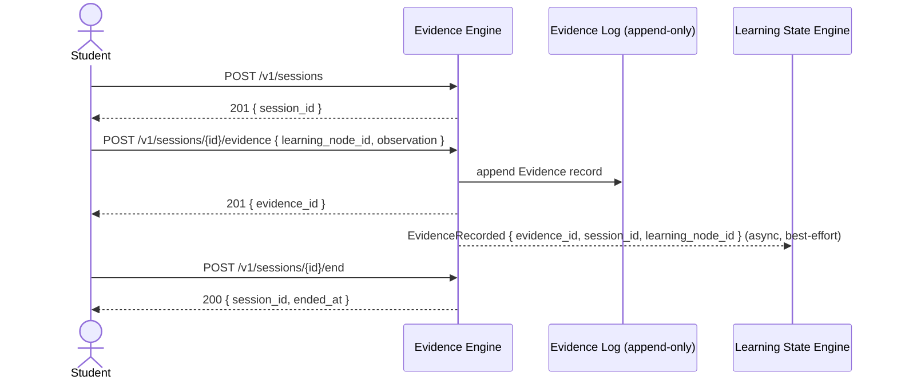
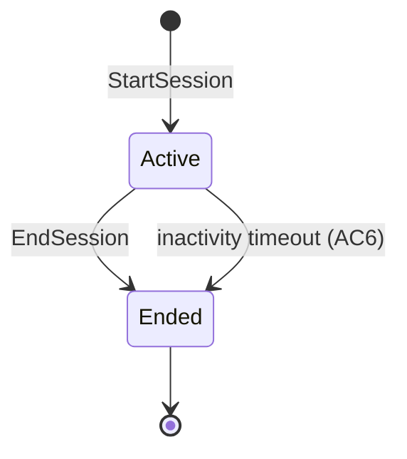

# Spec: Evidence Engine — Evidence Capture

- **Status:** Draft
- **Owning Engine(s):** Evidence Engine
- **Related ADRs:** [ADR-003](../adr/ADR-003-evidence-immutable.md)
  (binding: every write here is append-only).
- **Author / Date:** Phase 2 — Development

## Business Context

Learning State Engine can only be as honest as the Evidence it's given. This spec covers how the
platform captures Evidence during a Student's Session — the only fact-of-record the rest of the
Adaptive Loop trusts (`CLAUDE.md`'s Evidence-is-truth rule). Getting this capture path right, and
strictly immutable, is what makes every downstream Confidence value explainable later.

## Goals

1. A Student can start and end a Session.
2. Within an active Session, interactions with Generation Task output (answers, self-assessments,
   time spent, hints requested) are captured as Evidence.
3. Evidence, once written, is never mutated or deleted — corrections are new Evidence records.
4. Evidence capture never blocks or fails because a downstream Engine (Learning State, Generation)
   is unavailable.

**Non-goals:** computing Confidence from Evidence (that is `specs/learning-state-engine.md`),
Evidence analytics/reporting beyond what's needed to power Learning State Engine (Future Work).

## Requirements

| # | Requirement | Type | Traces to Goal |
|---|---|---|---|
| R1 | A Student can open exactly one active Session at a time. | Functional | 1 |
| R2 | Each Evidence record references the Session it occurred in, the Learning Node(s) it pertains to, and a timestamp. | Functional | 2 |
| R3 | Evidence records are append-only at the storage layer — no `UPDATE`/`DELETE` code path exists. | Functional | 3 |
| R4 | A correction to prior Evidence is submitted as a new Evidence record that references the record it supersedes. | Functional | 3 |
| R5 | Evidence write path has no synchronous dependency on Learning State Engine or Generation Engine. | Non-Functional | 4 |
| R6 | Evidence writes are durable before the API acknowledges the request. | Non-Functional | 2 |

## Acceptance Criteria

- [ ] **AC1** — Given a Student with no active Session, when they start one, then a new Session is
      created and its identifier returned.
- [ ] **AC2** — Given a Student with an active Session, when they attempt to start another, then
      the request is rejected (R1).
- [ ] **AC3** — Given an active Session, when Evidence is submitted, then it is persisted with
      Session id, Learning Node reference(s), and timestamp, and a confirmation is returned.
- [ ] **AC4** — Given an existing Evidence record, there is no API or internal code path capable of
      modifying or deleting it (R3) — attempted direct storage mutation is caught by an
      architecture test (`memory/coding-standards.md`).
- [ ] **AC5** — Given Learning State Engine is completely unavailable, when Evidence is submitted,
      then the write still succeeds (R5).
- [ ] **AC6** — Given an open Session with no `EndSession` call, then it is automatically closed
      after a configured inactivity timeout, and any Evidence already recorded remains valid.

## Sequence Diagram

## State Diagram

*This is the Session lifecycle. Evidence records themselves have no lifecycle — they are written
once and exist permanently (ADR-003); only the Session that contains them transitions state.*

## API

| Method | Path | Request | Response | Notes |
|---|---|---|---|---|
| `POST` | `/v1/sessions` | — | `201 { session_id, started_at }` | Rejects if one is already Active (AC2). |
| `POST` | `/v1/sessions/{id}/evidence` | `{ learning_node_id, observation, supersedes? }` | `201 { evidence_id }` | `supersedes` implements R4. |
| `POST` | `/v1/sessions/{id}/end` | — | `200 { session_id, ended_at }` | |

## Events

| Event | Producer | Consumers | Payload (key fields) |
|---|---|---|---|
| `SessionStarted` | Evidence Engine | Generation Engine | `session_id`, `student_id`, `started_at` |
| `EvidenceRecorded` | Evidence Engine | Learning State Engine | `evidence_id`, `session_id`, `learning_node_id`, `observation`, `recorded_at` |
| `SessionEnded` | Evidence Engine | Generation Engine, Learning State Engine | `session_id`, `ended_at` |

## Database

| Table | Owning Engine | Key Columns | Notes |
|---|---|---|---|
| `evidence.sessions` | Evidence Engine | `id`, `student_id`, `started_at`, `ended_at` | `ended_at` null while Active. |
| `evidence.evidence_records` | Evidence Engine | `id`, `session_id`, `learning_node_id`, `observation` (jsonb), `recorded_at`, `supersedes_id` | No `updated_at` — records are never updated (R3). Application role has no `UPDATE`/`DELETE` grant on this table. |

## Risks

| Risk | Likelihood | Impact | Mitigation |
|---|---|---|---|
| A future change adds an `UPDATE` path "just for a hotfix" | Medium | High | DB-level: revoke `UPDATE`/`DELETE` grants on `evidence_records` for the application role; architecture test asserts this (AC4). |
| Event delivery to Learning State Engine is lost | Low | Medium | Evidence write is durable and authoritative regardless (R5, R6); Learning State Engine can also poll/backfill from the Evidence log directly if needed. |
| Session left open indefinitely by a disconnected client | Medium | Low | Inactivity timeout auto-ends the Session (AC6). |

## Future Work

- Evidence analytics/reporting surface beyond what Learning State Engine needs.
- Configurable per-Learning-Node Evidence retention/compaction strategy (flagged, not solved, in
  ADR-003).

## Definition of Done

- [ ] All Acceptance Criteria above pass, including AC4 verified by an architecture test, not just
      a unit test of application code.
- [ ] `CLAUDE.md` is satisfied in full.
- [ ] `EvidenceRecorded` contract test exists and runs against both Evidence Engine (producer) and
      Learning State Engine (consumer).
