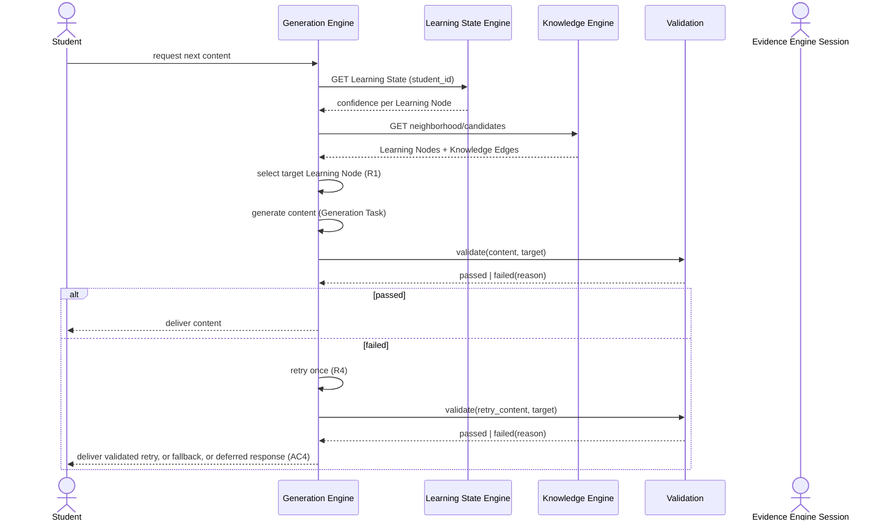
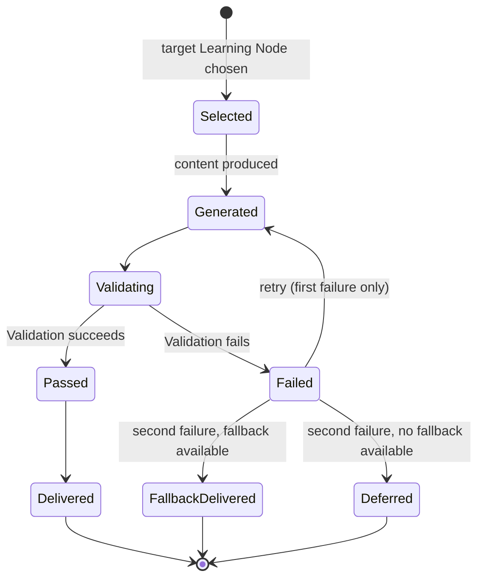

# Spec: Generation Engine — Generation Task and Validation

- **Status:** Draft
- **Owning Engine(s):** Generation Engine
- **Related ADRs:**
  [ADR-005](../adr/ADR-005-validation-gate.md) (binding: no output
  reaches a Student without passing Validation).
- **Author / Date:** Phase 2 — Development

## Business Context

This spec covers the step that closes the Adaptive Loop: deciding what a Student should see next,
producing it, and refusing to deliver anything that hasn't passed Validation. It is the only Engine
whose output a Student directly consumes, which is exactly why the Validation rule in `CLAUDE.md`
applies to it so strictly.

## Goals

1. Given a Student's Learning State and the Knowledge Graph, decide which Learning Node to target
   next and at what difficulty.
2. Produce content (a question, an explanation, an exercise) for a Generation Task targeting that
   Learning Node.
3. Route every Generation Task's output through Validation before it can be delivered.
4. On a Validation failure, retry or fall back — never deliver unvalidated content.

**Non-goals:** the specific generative technique/model used to produce content (swappable per
`PROJECT.md`), defining every Validation check for every content type (tracked per content type as
Future Work, per ADR-005).

## Requirements

| # | Requirement | Type | Traces to Goal |
|---|---|---|---|
| R1 | Selection of the next Learning Node considers Confidence (prefer low-confidence, unlock-eligible nodes) and Knowledge Edges (prerequisites satisfied first). | Functional | 1 |
| R2 | A Generation Task specifies target Learning Node, difficulty, and content type. | Functional | 1, 2 |
| R3 | Generated content is submitted to Validation before being marked deliverable. | Functional | 3 |
| R4 | A Validation failure triggers exactly one retry with adjusted generation parameters; a second failure falls back to previously-validated content for the same Learning Node if available, or defers delivery. | Functional | 4 |
| R5 | No API path allows delivering Generation Task output to a Student without a `Validation.passed = true` record. | Functional | 3, 4 |
| R6 | Generation + Validation completes within the latency budget for an in-session request. | Non-Functional | 1, 2 |

## Acceptance Criteria

- [ ] **AC1** — Given a Student's Learning State showing low Confidence on an unlocked Learning
      Node (all prerequisites above the confidence threshold), when a Generation Task is requested,
      then that Learning Node is selected as the target.
- [ ] **AC2** — Given a produced piece of content, when it passes Validation, then it becomes
      eligible for delivery and the Validation outcome is recorded.
- [ ] **AC3** — Given a produced piece of content that fails Validation, then it is never delivered
      to the Student, and a retry with adjusted parameters is attempted (R4).
- [ ] **AC4** — Given two consecutive Validation failures for the same Generation Task, then a
      previously-validated fallback is delivered if one exists for that Learning Node, or delivery
      is deferred with an explicit "nothing ready" response — never a silent failure.
- [ ] **AC5** — Given any attempt to call the delivery path directly with content that has no
      passing Validation record, then it is rejected (R5, verified by architecture test).

## Sequence Diagram

## State Diagram

*This is the lifecycle of one Generation Task, from target selection through delivery or deferral.*

## API

| Method | Path / Contract | Request | Response | Notes |
|---|---|---|---|---|
| `POST` | `/v1/sessions/{id}/next-content` | — | `200 { generation_task_id, content }` or `204` (deferred, AC4) | Never returns unvalidated content (R5). |
| Internal contract | `Validation.validate(content, targetLearningNode)` | — | `{ passed: bool, reason? }` | Called by this Engine only; not exposed externally. |

## Events

| Event | Producer | Consumers | Payload (key fields) |
|---|---|---|---|
| `GenerationTaskCompleted` | Generation Engine | Evidence Engine (for correlating future Evidence to delivered content) | `generation_task_id`, `session_id`, `learning_node_id`, `validation_outcome` |
| `ValidationFailed` | Generation Engine (Validation step) | Observability/Platform | `generation_task_id`, `reason`, `attempt` |

## Database

| Table | Owning Engine | Key Columns | Notes |
|---|---|---|---|
| `generation.generation_tasks` | Generation Engine | `id`, `session_id`, `student_id`, `learning_node_id`, `difficulty`, `status` | `status` per the State Diagram above. |
| `generation.validation_outcomes` | Generation Engine | `id`, `generation_task_id`, `attempt`, `passed`, `reason` | Every attempt recorded, not just the final one (AC2, auditability). |

## Risks

| Risk | Likelihood | Impact | Mitigation |
|---|---|---|---|
| Generation technique regresses and Validation failure rate spikes | Medium | Medium | `ValidationFailed` observability (events table) alerts on failure-rate threshold; fallback path (R4) keeps Students unaffected in the interim. |
| Validation itself has a blind spot for a new content type | Medium | High | Validation rules are content-type-specific and specified per type as they're built (Future Work); no content type ships without its own Validation spec. |
| Latency budget (R6) is missed under load, degrading Session experience | Medium | Medium | Pre-generation/caching of validated content ahead of demand, as anticipated in ADR-005's consequences. |

## Future Work

- Validation rule specification per content type (question, explanation, exercise) as each is
  built.
- Pre-generation/caching strategy to reduce in-session latency.
- Multi-armed-bandit or similar refinement of target-selection policy (R1) beyond the initial
  confidence/prerequisite heuristic.

## Definition of Done

- [ ] All Acceptance Criteria above pass, including AC5 verified by an architecture test.
- [ ] `CLAUDE.md` is satisfied in full.
- [ ] Target-selection logic (R1) and the Validation gate (R3–R5) are unit-tested as pure functions
      per `memory/coding-standards.md` §3.
- [ ] `GenerationTaskCompleted` contract test exists for Evidence Engine as consumer.
