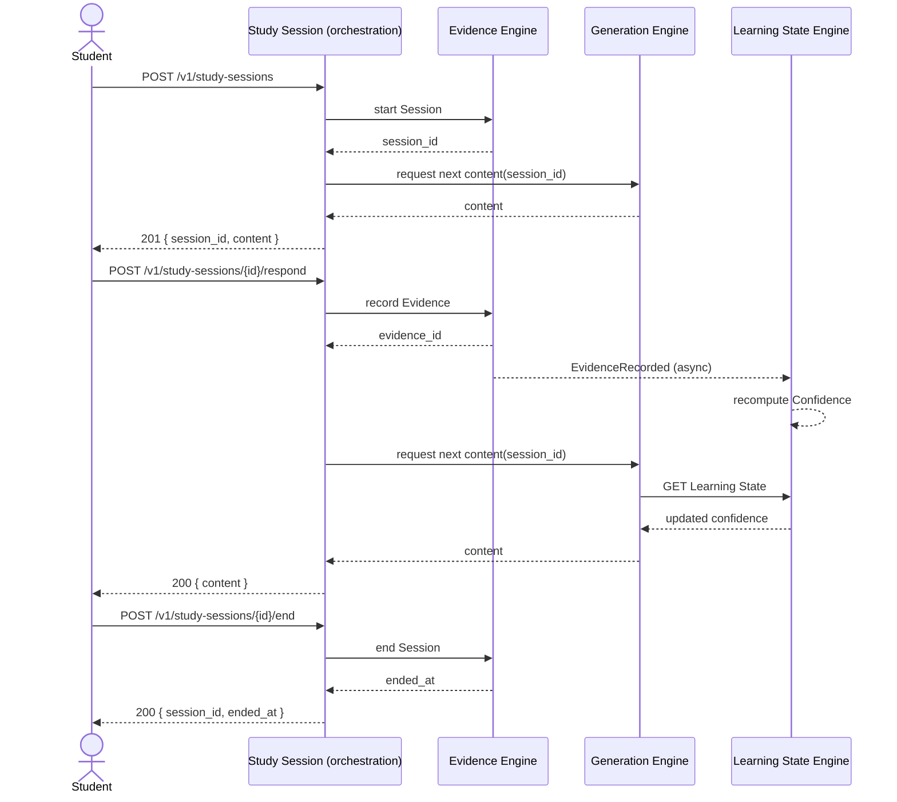
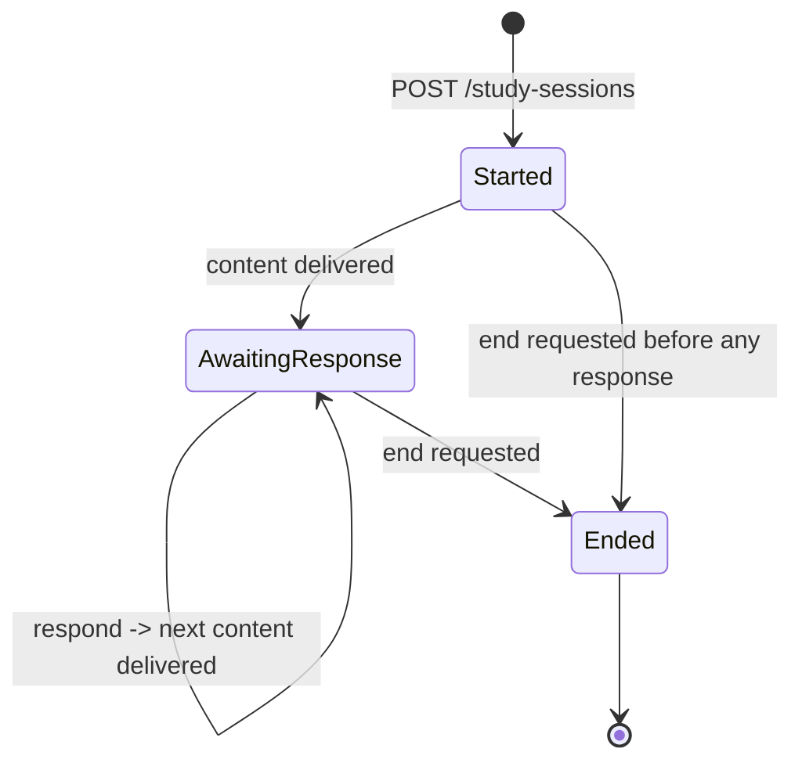

# Spec: Study Session — the Adaptive Loop, End to End

- **Status:** Draft
- **Owning Engine(s):** Cross-Engine (orchestrates Evidence Engine, Generation Engine, Learning
  State Engine, Knowledge Engine — owns none of their internals).
- **Related ADRs:** None new. This spec composes behavior already governed by ADR-001 (boundaries),
  ADR-003 (Evidence), ADR-004 (Confidence), ADR-005 (Validation) — it introduces no new decision,
  only their combination.
- **Author / Date:** Phase 2 — Development

## Business Context

`specs/evidence-engine.md` and `specs/generation-engine.md` each specify one half of the loop in
isolation. Neither, alone, describes what a Student actually experiences: opening a Session, being
given something to work on, responding, and having that response shape what comes next — live, in
one continuous interaction. This spec is that end-to-end path. It deliberately introduces no new
Engine behavior; it specifies the orchestration between existing published contracts, which is the
pattern any future cross-Engine, Student-facing feature should follow (see `CLAUDE.md`
§4 — this orchestration layer depends only on each Engine's contract, never on their internals).

## Goals

1. A Student can start a Study Session and immediately receive their first piece of content.
2. Responding to content records Evidence and triggers the next piece of content, without the
   Student needing to make a separate request for "what's next."
3. Ending a Study Session leaves all Evidence intact and Learning State correctly reflecting
   everything that happened.
4. The orchestration itself owns no state and holds no business logic that belongs to an Engine —
   it only sequences calls to published contracts.

**Non-goals:** changing how any individual Engine computes its own output (covered by their own
specs), multi-Student collaborative Sessions.

## Requirements

| # | Requirement | Type | Traces to Goal |
|---|---|---|---|
| R1 | Starting a Study Session opens an Evidence Engine Session and immediately requests first content from Generation Engine. | Functional | 1 |
| R2 | Submitting a response records Evidence via Evidence Engine, then requests next content from Generation Engine using the (now updated) Learning State. | Functional | 2 |
| R3 | Ending a Study Session ends the Evidence Engine Session; no orchestration-owned data is left dangling. | Functional | 3 |
| R4 | The orchestration layer contains no persistent storage of its own — everything it touches is owned by an Engine. | Functional | 4 |
| R5 | The step "Evidence recorded → Learning State updated → next content reflects it" completes within the same latency budget as a single Generation Engine call (R6 of `specs/generation-engine.md`). | Non-Functional | 2 |

## Acceptance Criteria

- [ ] **AC1** — Given a Student with no active Session, when they start a Study Session, then a
      Session is open and the first Generation Task's content is returned in the same response.
- [ ] **AC2** — Given an active Study Session with content delivered, when the Student submits a
      response, then Evidence referencing that content's Learning Node is recorded, and the next
      content returned reflects the updated Confidence for that Learning Node.
- [ ] **AC3** — Given an active Study Session, when the Student ends it, then the underlying
      Evidence Engine Session is ended and all recorded Evidence remains queryable, unchanged.
- [ ] **AC4** — Given the orchestration layer's own code, then it contains no direct database
      access — every read/write goes through an Engine's published contract (R4, verified by
      architecture test).

## Sequence Diagram

## State Diagram

*This state diagram belongs to the orchestration itself, not to a new persisted entity — it has no
table of its own (R4); the states above are a view composed from the underlying Evidence Engine
Session state (`specs/evidence-engine.md`) and the latest Generation Task status
(`specs/generation-engine.md`).*

## API

| Method | Path | Request | Response | Notes |
|---|---|---|---|---|
| `POST` | `/v1/study-sessions` | — | `201 { session_id, content }` | Composes Evidence Engine `start` + Generation Engine `next-content`. |
| `POST` | `/v1/study-sessions/{id}/respond` | `{ observation }` | `200 { content }` or `204` (deferred, per `specs/generation-engine.md` AC4) | Composes Evidence Engine `evidence` + Generation Engine `next-content`. |
| `POST` | `/v1/study-sessions/{id}/end` | — | `200 { session_id, ended_at }` | Delegates to Evidence Engine `end`. |

## Events

*Not applicable: this orchestration layer produces no events of its own — it only invokes existing
Engine contracts, each of which publishes its own events as specified in
`specs/evidence-engine.md` and `specs/generation-engine.md`.*

## Database

*Not applicable: per R4, the orchestration layer owns no storage. Every table involved belongs to
Evidence Engine, Generation Engine, or Learning State Engine, as specified in their own specs.*

## Risks

| Risk | Likelihood | Impact | Mitigation |
|---|---|---|---|
| Orchestration logic accretes business rules that should live inside an Engine | Medium | High | Review checklist §2/§6 explicitly checks for this; any rule beyond "call A, then call B" is a signal to move it into the owning Engine. |
| Partial failure (Evidence recorded, next-content call fails) leaves the Student stuck | Medium | Medium | `respond` is safe to retry — recording the same Evidence twice is prevented by Evidence Engine's own idempotency, and next-content can simply be re-requested. |

## Future Work

- Resuming a Study Session after a client disconnect mid-flow.
- Adaptive pacing signals (e.g., suggesting a break) — would likely require a new Learning State
  Engine capability, not just new orchestration.

## Definition of Done

- [ ] All Acceptance Criteria above pass, including AC4 verified by an architecture test asserting
      the orchestration layer has zero database dependencies.
- [ ] `CLAUDE.md` is satisfied in full.
- [ ] End-to-end integration test covers the full Start → Respond (×N) → End path against real
      Evidence Engine, Generation Engine, and Learning State Engine implementations (not mocks —
      see `memory/coding-standards.md`).
