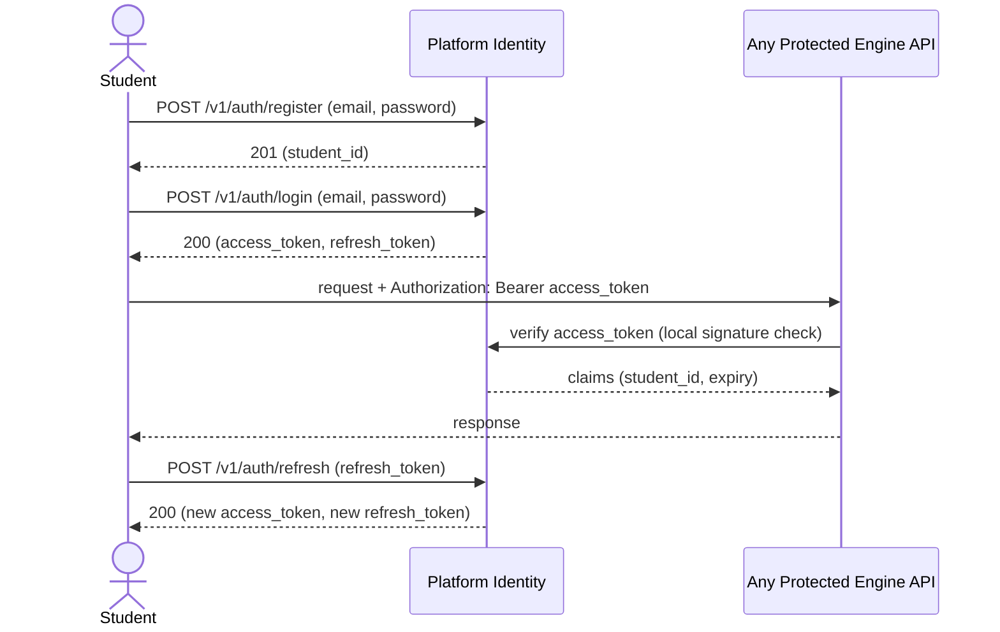
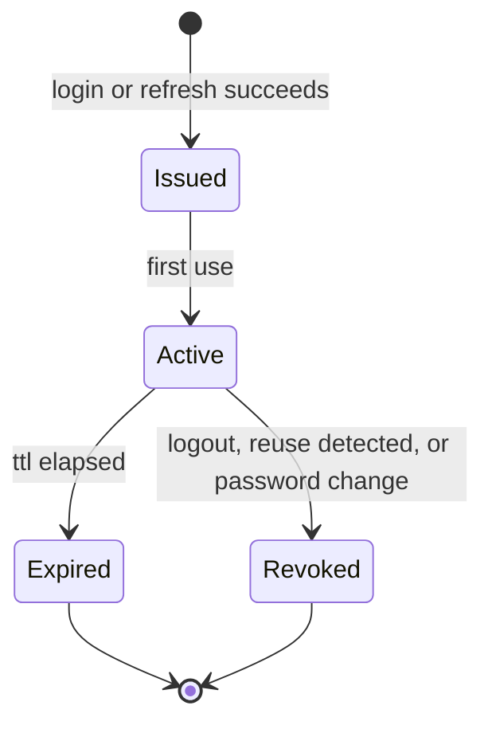

# Spec: Authentication

- **Status:** Draft
- **Owning Engine(s):** None of the five Engines. This is a **Platform** capability
  (`platform/` in `docs/repository-structure.md`'s planned layout) — identity is a supporting
  concern every Engine depends on, not a bounded context that models adaptive learning itself.
- **Related ADRs:** None yet. If token strategy or password-storage approach is later revisited in
  a way that breaks issued credentials, that revision needs one.
- **Author / Date:** Phase 2 — Development

> **Naming note:** this spec introduces **Access Token** and **Refresh Token**. Neither is related
> to the glossary term **Session** (`glossary/README.md`), which denotes a Student's bounded
> learning interaction captured by Evidence Engine. A Student may hold one Auth Token while
> participating in zero or many Sessions. Keeping these separate is deliberate — see Article VI of
> `/.ai/constitution.md`.

## Business Context

Every Engine that acts on behalf of a Student — recording Evidence, opening a Session, returning
Learning State — needs to know, reliably, *which* Student is making the request. Without that,
Evidence Engine cannot trust that a submitted Evidence record actually belongs to the Student it
claims, which undermines Article IV ("Evidence is Truth") at its root: evidence attributed to the
wrong Student is worse than no evidence at all. Authentication is the platform capability that
resolves every request to exactly one Student (or to "anonymous," for the parts of the platform
that don't require identity).

## Goals

1. A prospective Student can create an account and authenticate.
2. Every request into a Student-facing API resolves to exactly one authenticated Student, or is
   explicitly rejected.
3. Credentials are stored such that a database compromise does not expose usable passwords.
4. A compromised Access Token has a short, bounded blast radius.

**Non-goals:** social/SSO login providers, multi-tenant/organization-level accounts, role-based
authorization beyond "authenticated Student" vs. "anonymous," email verification enforcement. All
tracked under Future Work.

## Requirements

| # | Requirement | Type | Traces to Goal |
|---|---|---|---|
| R1 | A prospective Student can register with an email and password. | Functional | 1 |
| R2 | A registered Student can authenticate and receive an Access Token and Refresh Token. | Functional | 1, 2 |
| R3 | Every protected endpoint rejects requests without a valid, unexpired Access Token. | Functional | 2 |
| R4 | A valid Refresh Token can be exchanged for a new Access Token, rotating the Refresh Token. | Functional | 4 |
| R5 | Passwords are hashed with a memory-hard algorithm (Argon2id); plaintext is never persisted or logged. | Non-Functional | 3 |
| R6 | Access Tokens expire within 15 minutes; Refresh Tokens expire within 30 days and are single-use. | Non-Functional | 4 |
| R7 | Authentication endpoints are rate-limited per IP and per account to resist credential stuffing. | Non-Functional | 3 |

## Acceptance Criteria

- [ ] **AC1** — Given a unique email and a password meeting policy, when `POST /v1/auth/register`
      is called, then a `201` is returned with the new Student's identifier and no password field.
- [ ] **AC2** — Given correct credentials, when `POST /v1/auth/login` is called, then a `200` is
      returned with an Access Token and a Refresh Token.
- [ ] **AC3** — Given an expired or missing Access Token, when a protected endpoint is called, then
      a `401` is returned and no Engine logic executes.
- [ ] **AC4** — Given a valid, unused Refresh Token, when `POST /v1/auth/refresh` is called, then a
      new Access Token and Refresh Token pair is issued and the old Refresh Token is invalidated.
- [ ] **AC5** — Given a Refresh Token that was already used once, when it is presented again, then
      the request is rejected and the entire token family is revoked (reuse indicates theft).
- [ ] **AC6** — Given repeated failed login attempts for one account beyond the configured
      threshold, then further attempts are rate-limited regardless of correctness.

## Sequence Diagram

## State Diagram

*This is the lifecycle of one Refresh Token. Access Tokens are stateless (signed, self-expiring)
and are not tracked server-side; only Refresh Tokens have server-side state to support rotation and
reuse detection (AC5).*

## API

| Method | Path | Request | Response | Notes |
|---|---|---|---|---|
| `POST` | `/v1/auth/register` | `{ email, password }` | `201 { student_id }` | Password never echoed. |
| `POST` | `/v1/auth/login` | `{ email, password }` | `200 { access_token, refresh_token, expires_in }` | Rate-limited (R7). |
| `POST` | `/v1/auth/refresh` | `{ refresh_token }` | `200 { access_token, refresh_token, expires_in }` | Rotates the token (AC4). |
| `POST` | `/v1/auth/logout` | `{ refresh_token }` | `204` | Revokes the token family. |

## Events

| Event | Producer | Consumers | Payload (key fields) |
|---|---|---|---|
| `StudentRegistered` | Platform Identity | None yet — reserved for future onboarding/analytics consumers | `student_id`, `registered_at` |

## Database

| Table | Owning Engine | Key Columns | Notes |
|---|---|---|---|
| `platform.accounts` | Platform | `id`, `student_id` (Shared Kernel identifier), `email` (unique), `password_hash`, `created_at` | One account per Student. |
| `platform.refresh_tokens` | Platform | `id`, `account_id`, `token_hash`, `family_id`, `expires_at`, `used_at`, `revoked_at` | `token_hash` only — raw token never stored. |

## Risks

| Risk | Likelihood | Impact | Mitigation |
|---|---|---|---|
| Credential stuffing against `/login` | Medium | High | Per-IP and per-account rate limiting (R7); Argon2id slows brute force. |
| Refresh Token theft and replay | Low | High | Rotation + reuse detection revokes the whole family (AC5). |
| Password database compromise | Low | High | Argon2id hashing (R5); plaintext never logged or persisted. |
| Clock skew causing premature Access Token rejection | Low | Low | Short expiry with generous clock-skew tolerance in verification. |

## Future Work

- Social/SSO login providers.
- Multi-factor authentication.
- Email verification enforcement before first login.
- Account recovery / password reset flow.
- Role-based authorization beyond "authenticated Student."

## Definition of Done

- [ ] All Acceptance Criteria above pass.
- [ ] `/.ai/definition-of-done.md` is satisfied in full.
- [ ] No glossary term was redefined; "Access Token"/"Refresh Token" are documented here as
      infrastructure-level, not added to `/glossary/README.md` (they are not business concepts —
      see `/.ai/coding-philosophy.md` §1).
- [ ] Password hashing and token verification code has unit tests exercising both success and
      failure paths (AC3, AC5 in particular).
