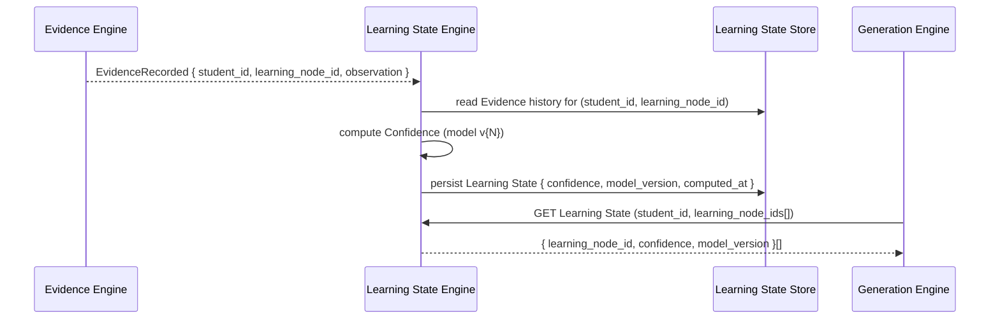
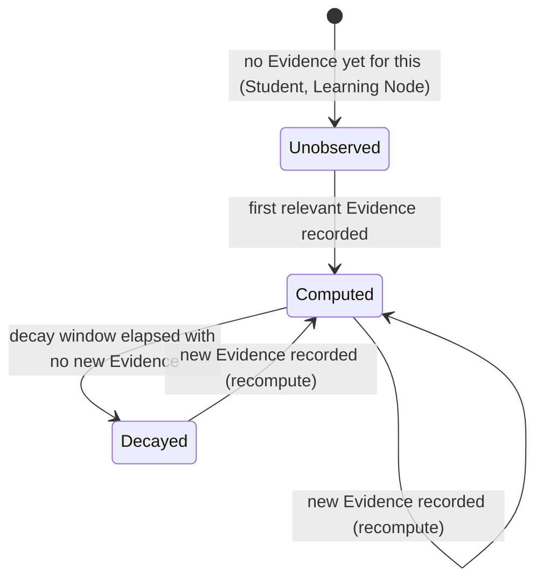

# Spec: Learning State Engine — Confidence Computation

- **Status:** Draft
- **Owning Engine(s):** Learning State Engine
- **Related ADRs:**
  [ADR-003](../adr/ADR-003-evidence-is-an-immutable-append-only-log.md),
  [ADR-004](../adr/ADR-004-confidence-is-a-derived-recomputable-projection.md) (both binding on
  this spec).
- **Author / Date:** Phase 2 — Development

## Business Context

This is the spec for the step that turns raw Evidence into something usable: a Student's Learning
State, expressed as Confidence per Learning Node. Every decision Generation Engine makes about what
to show a Student next depends on this being accurate, explainable, and — per ADR-004 — never
hand-edited.

## Goals

1. Learning State Engine consumes `EvidenceRecorded` events and (re)computes affected Confidence
   values.
2. A Confidence value is always explainable as a function of specific Evidence records.
3. Confidence decays over time for a Learning Node with no recent Evidence, reflecting forgetting.
4. The confidence model is versioned, and historical Learning State can be recomputed under a new
   version without losing the old one's explanation.

**Non-goals:** the specific machine-learning technique used inside the confidence model (an
implementation detail, swappable per Article I of the Constitution), UI presentation of Confidence
(that is `specs/student-progress.md`).

## Requirements

| # | Requirement | Type | Traces to Goal |
|---|---|---|---|
| R1 | On `EvidenceRecorded`, recompute Confidence for the referenced Learning Node(s) for that Student. | Functional | 1 |
| R2 | Confidence is always computed from the full Evidence history for a (Student, Learning Node) pair as of a point in time — never from a mutable running total. | Functional | 2 |
| R3 | Confidence for a Learning Node decays toward a floor value as time since the last relevant Evidence increases. | Functional | 3 |
| R4 | Every Learning State record stores the confidence model version that produced it. | Functional | 4 |
| R5 | No code path outside this Engine may write a Confidence value directly (ADR-004). | Functional | 2 |
| R6 | Recomputation for a single Learning Node completes fast enough to run synchronously on the Evidence-write path without perceptible delay to the Student. | Non-Functional | 1 |
| R7 | A backfill capability exists to recompute historical Learning State when the confidence model version changes. | Non-Functional | 4 |

## Acceptance Criteria

- [ ] **AC1** — Given a new `EvidenceRecorded` event for a Learning Node, when processed, then that
      Student's Confidence for that Learning Node is recomputed and persisted.
- [ ] **AC2** — Given two Students with identical Evidence for the same Learning Node, then their
      computed Confidence values are identical (determinism, R2).
- [ ] **AC3** — Given a Learning Node with no new Evidence for a configured decay window, when
      Confidence is next read, then it reflects decay toward the floor rather than the stale
      high-water value.
- [ ] **AC4** — Given a request to read Confidence, then the response includes the confidence model
      version that produced it.
- [ ] **AC5** — Given any attempt to call a Learning State write path directly with a Confidence
      value (bypassing Evidence), then it is rejected — no such path is exposed (R5, verified by
      architecture test).
- [ ] **AC6** — Given the confidence model version changes, when the backfill job runs for a
      Student, then their historical Learning State is recomputed under the new version and the
      prior version's values remain queryable by version.

## Sequence Diagram

## State Diagram

*This is the lifecycle of one (Student, Learning Node) Learning State projection — not of Evidence
itself, which has no lifecycle beyond "written."*

## API

| Method | Path / Contract | Request | Response | Notes |
|---|---|---|---|---|
| `GET` | `/v1/students/{id}/learning-state?node_ids=...` | — | `200 [{ learning_node_id, confidence, model_version, computed_at }]` | Read-only; no write endpoint exists (R5). |
| Internal contract | `LearningState.get(studentId, nodeIds[])` | — | — | Used synchronously by Generation Engine (R6). |

## Events

| Event | Producer | Consumers | Payload (key fields) |
|---|---|---|---|
| `LearningStateUpdated` | Learning State Engine | Generation Engine | `student_id`, `learning_node_id`, `confidence`, `model_version` |

## Database

| Table | Owning Engine | Key Columns | Notes |
|---|---|---|---|
| `learning_state.projections` | Learning State Engine | `student_id`, `learning_node_id`, `confidence`, `model_version`, `computed_at` | A cache/projection over Evidence (R2) — safe to fully rebuild from `evidence.evidence_records` at any time. |
| `learning_state.model_versions` | Learning State Engine | `version`, `description`, `activated_at` | Supports R4/R7. |

## Risks

| Risk | Likelihood | Impact | Mitigation |
|---|---|---|---|
| Recomputation on every Evidence write becomes a latency bottleneck at scale | Medium | Medium | Scope recomputation to only the affected Learning Node(s) (R1); revisit with async recomputation + cache if R6 stops holding, tracked as future ADR if it requires an architecture change. |
| A well-meaning "quick fix" adds a manual Confidence override | Medium | High | No such endpoint exists by design (R5); enforced via architecture test (AC5), not just convention. |
| Decay model produces confidence swings that feel arbitrary to Students | Medium | Medium | Decay parameters validated against `testing/golden-dataset.md` before rollout; model version recorded for explainability (AC4). |

## Future Work

- Confidence uncertainty bounds (not just a point estimate).
- Cross-Learning-Node propagation (e.g., strong Confidence in a prerequisite slightly informing a
  dependent node's prior) — deliberately out of scope until the single-node model is proven.

## Definition of Done

- [ ] All Acceptance Criteria above pass, including AC5 verified by an architecture test.
- [ ] `/.ai/definition-of-done.md` is satisfied in full.
- [ ] Confidence computation is a pure function of Evidence + model version, unit-tested without
      mocks per `.ai/coding-philosophy.md` §3.
- [ ] `LearningStateUpdated` contract test exists for Generation Engine as consumer.
