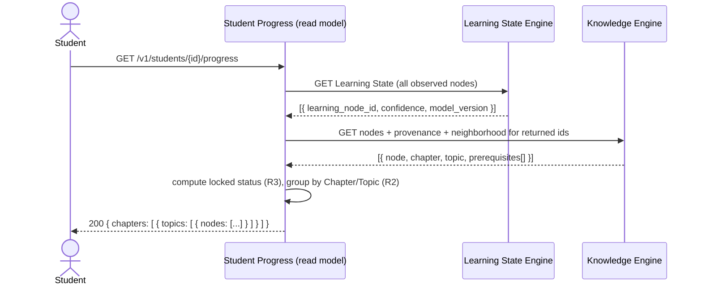

# Spec: Student Progress

- **Status:** Draft
- **Owning Engine(s):** Cross-Engine, read-only (primarily reads Learning State Engine and
  Knowledge Engine; owns no internals of either).
- **Related ADRs:** None new — this spec is a read model over existing, already-governed data
  (ADR-004: Confidence is always a projection, so this view is safe to build directly on top of it).
- **Author / Date:** Phase 2 — Development

## Business Context

A Student's Confidence values are only useful to them if they can see them in a way that means
something: "you've mastered these Learning Nodes, you're working on these, these are locked until
you build the prerequisites." This spec defines that read-only view. It introduces no new business
concept — it composes Confidence (Learning State Engine) with the Knowledge Graph's structure
(Knowledge Engine) into a presentable shape, and nothing here may write back to either.

## Goals

1. A Student can view their Confidence across every Learning Node they've encountered.
2. Learning Nodes are presented grouped by their Knowledge Graph structure (e.g., by Chapter/Topic
   provenance), so progress reads as a map, not a flat list.
3. Locked Learning Nodes (prerequisites not yet met) are visibly distinguished from unlocked ones.
4. The view is always read-only — nothing in this spec introduces a way to set Confidence directly
   (that would violate ADR-004).

**Non-goals:** editable goals/targets set by the Student, comparative/social progress (e.g.,
leaderboards), notifications about progress changes (Future Work).

## Requirements

| # | Requirement | Type | Traces to Goal |
|---|---|---|---|
| R1 | Return every Learning Node the Student has any Learning State for, with current Confidence and model version. | Functional | 1 |
| R2 | Group returned Learning Nodes by the Document/Chapter/Topic they were extracted from, using Knowledge Engine's provenance data. | Functional | 2 |
| R3 | For each Learning Node, compute "locked" status from whether its prerequisite Knowledge Edges point to Learning Nodes above the confidence threshold. | Functional | 3 |
| R4 | This spec exposes no write endpoint and no code path that sets Confidence or Learning State directly. | Functional | 4 |
| R5 | The view responds within an interactive latency budget even for a Student with a large Knowledge Graph history. | Non-Functional | 1 |

## Acceptance Criteria

- [ ] **AC1** — Given a Student with Learning State on several Learning Nodes, when they request
      their progress, then every one of those Learning Nodes appears with its current Confidence.
- [ ] **AC2** — Given Learning Nodes extracted from two different Chapters, when progress is
      requested, then the response groups them under their respective Chapter/Topic.
- [ ] **AC3** — Given a Learning Node whose prerequisite is below the confidence threshold, when
      progress is requested, then that Learning Node is marked locked.
- [ ] **AC4** — Given a Learning Node with no Evidence yet, then it does not appear as "mastered" or
      "in progress" — it is either omitted or explicitly marked unobserved, never defaulted to a
      misleading value.
- [ ] **AC5** — Given the API surface of this spec, then no endpoint accepts a Confidence or
      Learning State value as input (R4, verified by architecture/contract review).

## Sequence Diagram

## State Diagram

*Not applicable: this spec introduces no stateful entity of its own. It presents the state of
existing entities — Learning State (`specs/learning-state-engine.md`) and Learning Node
(`specs/knowledge-engine.md`) — without adding a lifecycle to either.*

## API

| Method | Path | Request | Response | Notes |
|---|---|---|---|---|
| `GET` | `/v1/students/{id}/progress` | — | `200 { chapters: [{ id, title, topics: [{ id, title, nodes: [{ id, label, confidence, model_version, locked }] }] }] }` | Read-only; no corresponding write endpoint exists anywhere in this spec (R4). |

## Events

*Not applicable: this is a read model; it produces no events and consumes none directly (it reads
current state from Learning State Engine and Knowledge Engine on request rather than subscribing to
their events).*

## Database

*Not applicable: no new tables. This spec queries `learning_state.projections` and
`knowledge.learning_nodes` / `knowledge.knowledge_edges` / `knowledge.node_provenance` through each
Engine's published contract — never directly — per `.ai/architecture.md` §4.*

## Risks

| Risk | Likelihood | Impact | Mitigation |
|---|---|---|---|
| Composing two Engines' data per request is slow for Students with long history | Medium | Medium | Batch contract calls (single "all observed nodes" query, R1) rather than per-node round trips; revisit with a dedicated read-optimized projection if R5 stops holding. |
| Someone later adds a "quick" write endpoint here for convenience | Low | High | Explicitly forbidden by R4/AC5; reviewers check this spec's API section against any PR that touches this read model. |
| Locked/unlocked computation drifts from Generation Engine's own eligibility logic (`specs/generation-engine.md` R1) | Medium | Medium | Both derive from the same Knowledge Edge + confidence-threshold rule; if the rule changes, it changes in one place referenced by both specs, not duplicated silently. |

## Future Work

- Progress-change notifications.
- Historical trend view (Confidence over time), which would read multiple `model_version`s / time
  slices rather than only the latest.

## Definition of Done

- [ ] All Acceptance Criteria above pass, including AC5 verified by an explicit check that this
      spec's API section contains no write operation.
- [ ] `/.ai/definition-of-done.md` is satisfied in full.
- [ ] Locked-status computation (R3) is unit-tested as a pure function per
      `.ai/coding-philosophy.md` §3, independent of the HTTP layer.
