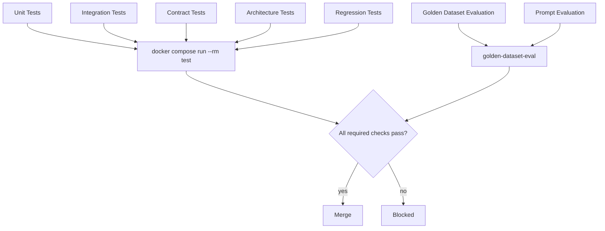

# Testing Strategy

This is the strategic layer: which kinds of tests exist, what each is responsible for, and how they
compose to make `docker compose run --rm test` (`CLAUDE.md`, `skills/docker.md`) a trustworthy
signal. For the craft of writing an individual test well, see `skills/testing.md` — that document
is the practical companion to this one.

## The Shape of the Suite

Most of the suite (unit, integration, contract, architecture, regression) is pass/fail and runs on
every PR via `docker compose run --rm test`. Golden Dataset and Prompt Evaluation are score-based
rather than strictly pass/fail and run as their own CI job (`skills/github-actions.md`) scoped to
changes touching Knowledge Engine extraction or Generation Engine content — they still block merge
on a regression, they just measure quality on a spectrum rather than a boolean.

## The Six Layers

| Layer | Answers | Detail |
|---|---|---|
| [Unit](unit-testing.md) | Does this business rule behave correctly, in isolation? | Pure `domain`/`application` functions, no I/O, no mocks. |
| [Integration](integration-testing.md) | Does this adapter correctly talk to the real system it wraps (and does a published contract hold between two real Engines)? | Real, containerized dependencies — never a mocked driver. |
| [Architecture](architecture-testing.md) | Does the code actually obey the boundaries `.ai/architecture.md` and `.ai/constitution.md` declare? | Mechanically enforced, not just reviewed by eye. |
| [Golden Dataset](golden-dataset.md) | Is extraction/generation quality still good against known-correct examples? | Curated reference data, scored over time. |
| [Prompt Evaluation](prompt-evaluation.md) | Does a prompt change hold up against a quality rubric before it ships? | Rubric-scored, dataset-driven, distinct from Validation itself. |
| [Regression](regression-testing.md) | Once fixed, does a bug ever come back? | Every bug fix ships with a test that would have caught it. |

## Where Contract Tests Fit

Contract tests — pinning the shape and meaning of what one Engine publishes and another consumes
(`.ai/development-principles.md` §6) — run against both the producer and every declared consumer,
using real implementations of both. They're covered under `integration-testing.md`, since they
share integration testing's core property: no mocks, real code on both sides of the boundary being
tested.

## Non-Negotiables This Suite Exists to Protect

Several tests in this suite exist specifically to make the invariants in `.ai/constitution.md`
mechanically true, not just documented:

- **Evidence immutability** (Article IV, ADR-003) — an architecture test asserting no `UPDATE`/
  `DELETE` grant exists on `evidence.evidence_records` (`specs/evidence-engine.md` AC4).
- **No direct Confidence writes** (Article IV, ADR-004) — an architecture test asserting no such
  write path is exposed anywhere in the codebase (`specs/learning-state-engine.md` AC5).
- **The Validation gate** (Article V, ADR-005) — an architecture test asserting the delivery path
  cannot be reached with unvalidated content (`specs/generation-engine.md` AC5).
- **Engine boundaries** (Article III, `.ai/architecture.md` §4) — an architecture test asserting no
  Engine package imports another Engine's package directly.

If a spec's Definition of Done says "verified by architecture test," the test lives in
`architecture-testing.md`'s domain, not as an informal review-time check.

## Running Scoped Subsets

`docker compose run --rm test` runs everything. During local iteration, scope it to what you're
working on (e.g. `docker compose run --rm test tests/unit/knowledge_engine`) — but a change is not
Done (`.ai/definition-of-done.md`) until the full, unscoped suite passes.
